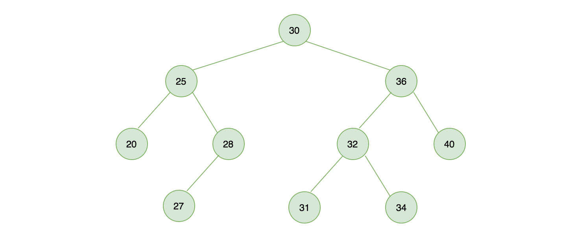
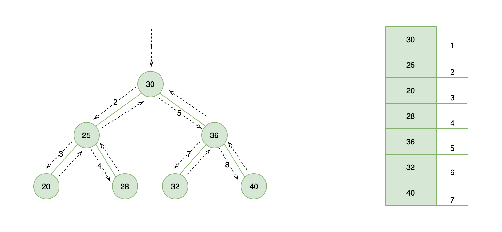
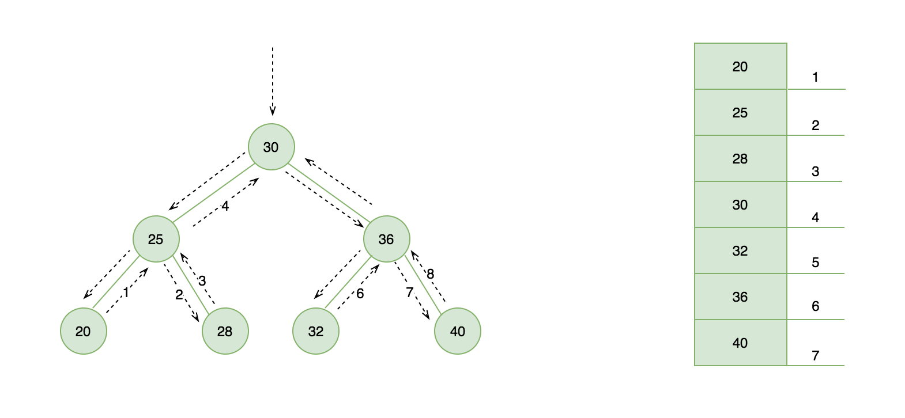
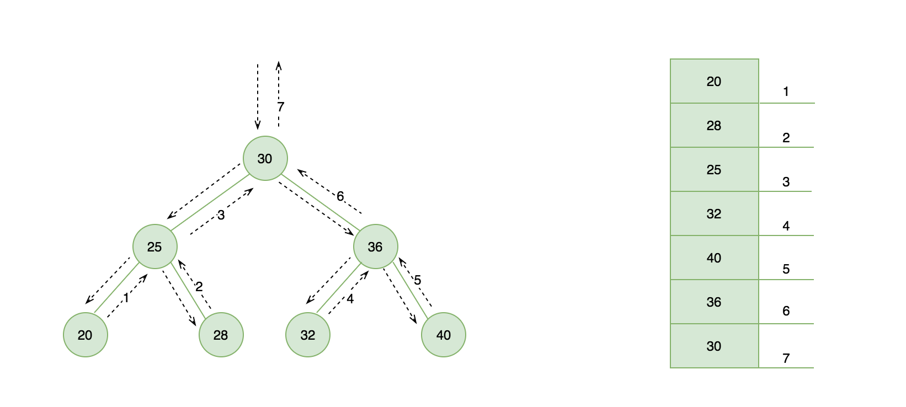
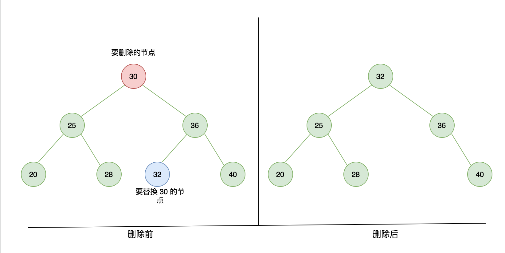
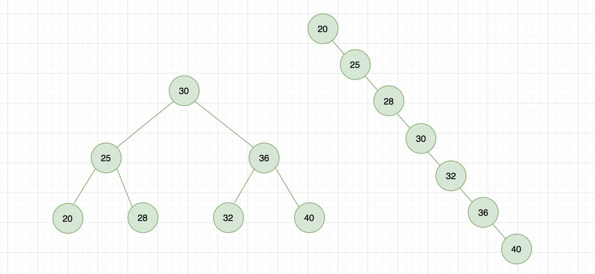

# 二叉搜索树

二叉树在计算机科学中应用很广泛，学习它有助于让我们写出高效的插入、删除、搜索节点算法。二叉树的节点定义：一个节点最多只有两个节点，分别为左侧节点、右侧节点。

二叉搜索树是二叉树中的一种，在二叉搜索树中每个父节点的键值要大于左边子节点小于右边子节点。下图展示一颗二叉搜索树。



## 二叉搜索树实现大纲

本文将使用 JavaScript 语言，实现一个二叉搜索树，以下为实现的方法：

* constructor()：构造函数，初始化一个二叉搜索树
* insert(value)：二叉树中查找一个节点，如果存在返回 true 否则返回 false
* preOrderTraverse(cb)：先序遍历或称前序遍历
* inOrderTraverse(cb)：中序遍历
* postOrderTraverse(cb)：后序遍历
* minNodeValue()：最小节点值
* maxNodeValue()：最大节点值
* removeNode(value)：移除节点
* destory()：销毁节点

**注意**：在实现二叉树搜索🌲的很多方法中我们将使用大量的递归操作，如果对它不了解的，可以自行查阅资料学习。

## 初始化一个二叉搜索树

声明一个 BST 类，在构造函数的 constructor() 里声明它的结构：

```js
class BST {
    constructor () {
        this.root = null; // 初始化根节点
        this.count = 0; // 记录二叉搜索的节点数量

        /**
         * 实例化一个 node 节点，在 insert 方法中你会看到
         */
        this.Node = function(value) {
            return {
                value, // 节点值
                count: 1, // 节点数量，允许节点重复
                left: null, // 左侧子节点
                right: null, // 右侧子节点
            }
        }
    }
```

在之前的顺序表文章中介绍了双向链表，与之类似，我们使用 left、right 一个指向左侧节点、一个指向右侧节点。

## 二叉搜索树插入节点

定义 insert 插入方法，接受一个 value 我们即将要插入的节点的值，在内部方法中调用 INSERT_RECUSIVE() 这个递归函数实现节点插入，返回结果给到 root。

```js
/**
 * 二叉搜索树插入元素
 * @param { Number } value 
 */
insert(value) {
    this.root = this[INSERT_RECUSIVE](this.root, value);
}
```

INSERT_RECUSIVE 使用 Symbol 进行声明

```js
const INSERT_RECUSIVE = Symbol('BST#recursiveInsert');
```

主要目的为实现私有化，仅类内部调用，类似于 Private 声明。

```js
/**
 * 递归插入
 * 插入过程和链表类似，建议先学习链表会更容易理解
 * @param { Object } node 
 * @param { Number } value 
 */
[INSERT_RECUSIVE](node, value) {
    // {1} 如果当前节点为空，创建一个新节点（递归到底）
    if (node === null) {
        this.count++; // 节点数加 1
        return new this.Node(value);
    }

    // {2} 节点数不变，说明要更新的值等于二叉树中的某个节点值
    if (value === node.value) {
        node.count++; // 节点数加 1
    } else if (value < node.value) { // {3} 新插入子节点在二叉树左边，继续递归插入
        node.left = this[INSERT_RECUSIVE](node.left, value);
    } else if (value > node.value) { // {4} 新插入子节点在二叉树右边，继续递归插入
        node.right = this[INSERT_RECUSIVE](node.right, value);
    }

    return node;
}
```

下图给出一个树结构图，我们使用刚刚写好的代码进行测试，生成如下结构所示的二叉搜索树：


刚开始我需要 new 一个 bST 对象实例，执行 insert 方法插入节点

* 第一次执行 bST.insert(30) 树是空的，代码行 {1} 将会被执行调用 new this.Node(value) 插入一个新节点。
* 第二次执行 bST.insert(25) 树不是空的，25 比 30 小（value < node.value），代码行 {3} 将会被执行，在树的左侧递归插入并调用 INSERT_RECUSIVE 方法传入 node.left，第二次递归时由于 node.left 已经为 null，所以插入新节点
* 第三次执行 bST.insert(36) 同理，执行顺序为 {4} -> 递归 {1}
 
```js
const bST = new BST();

bST.insert(30);
bST.insert(25);
bST.insert(36);
bST.insert(20);
bST.insert(28);
bST.insert(32);
bST.insert(40);

console.dir(bST, { depth: 4 })
```

## 二叉搜索树查找节点

在 JavaScript 中我们可以通过 hasOwnProperty 来检测指定 key 在对象是否存在，现在我们在二叉搜索中实现一个类似的方法，传入一个值 value 判断是否在二叉搜索树中存在

```js
/**
 * 二叉树中搜索节点
 * @param { Number } value 
 * @return { Boolean } [true|false]
 */
search(value) {
    return this[SEARCH_RECUSIVE](this.root, value);
}
```

同样声明一个 SEARCH_RECUSIVE 辅助函数实现递归搜索查找

* 行 {1} 先判断传入的 node 是否为 null，如果为 null 就表示查找失败，返回 false。
* 行 {2} 说明已经找到了节点，返回 true。
* 行 {3} 表示要找的节点，比当前节点小，在左侧节点继续查找。
* 行 {4} 表示要找的节点，比当前节点大，在右侧节点继续查找。

```js
/**
 * 递归搜索
 * @param { Object } node 
 * @param { Number } value 
 */
[SEARCH_RECUSIVE](node, value) {
    if (node === null) { // {1} 节点为 null
        return false;
    } else if (value === node.value) { // {2} 找到节点
        return true;
    } else if (value < node.value) { // {3} 从左侧节点搜索
        return this[SEARCH_RECUSIVE](node.left, value);
    } else { // {4} 从右侧节点搜索
        return this[SEARCH_RECUSIVE](node.right, value);
    }
}
```

上面我们已经在树中插入了一些节点，现在进行测试，20 在树中是有的，返回了 true，而树中我们没有插入过 10 这个值，因此它返回了 false。

```js
bST.search(20); // true
bST.search(10); // false
```

## 二叉搜索树遍历

遍历是一个很常见的操作，后续再学习其它树相关结构中也都会用到，对一颗树的遍历从哪里开始？顶端、低端还是左右呢？不同的方式带来的结果是不同的，共分为前序、中序、后序三种方式遍历，下面分别予以介绍。

### 先序遍历

优先于后台节点的顺序访问每个节点。

```js
/**
 * 先序遍历（前序遍历）
 * @param { Function } cb 
 */
preOrderTraverse(cb) {
    return this[PRE_ORDER_TRAVERSE_RECUSIVE](this.root, cb);
}
```

声明 PRE_ORDER_TRAVERSE_RECUSIVE 辅助函数进行前序遍历，步骤如下：

* 行 {1} 先访问节点本身（从树的顶端开始）
* 行 {2} 访问左侧节点
* 行 {3} 访问右侧节点

```js
/**
 * 先序遍历递归调用
 * @param { Object } node 
 * @param { Function } cb 
 */
[PRE_ORDER_TRAVERSE_RECUSIVE](node, cb) {
    if (node !== null) {
        cb(node.value); // {1} 先访问节点本身（从树的顶端开始）
        this[PRE_ORDER_TRAVERSE_RECUSIVE](node.left, cb); // {2} 访问左侧节点
        this[PRE_ORDER_TRAVERSE_RECUSIVE](node.right, cb); // {3} 访问右侧节点
    }
}
```

下图左侧展示了先序遍历的访问路径，右侧为输出。



### 中序遍历

中序遍历，先访问左侧节点，直到为最小节点访问到树的最底端，将当前节点的 value 取出来，在访问右侧节点，适用于从小到大排序。

```js
/**
 * 中序遍历
 * @param { Function } cb 
 */
inOrderTraverse(cb) {
    return this[IN_ORDER_TRAVERSE_RECUSIVE](this.root, cb);
}
```

声明 IN_ORDER_TRAVERSE_RECUSIVE 辅助函数进行中序遍历，步骤如下：

* 行 {1} 访问左侧节点
* 行 {2} 访问节点本身
* 行 {3} 访问右侧节点

```js
/**
 * 中序遍历递归调用
 * @param { Object } node 
 * @param {Function } cb 
 */
[IN_ORDER_TRAVERSE_RECUSIVE](node, cb) {
    if (node !== null) {
        this[IN_ORDER_TRAVERSE_RECUSIVE](node.left, cb); // {1} 访问左侧节点
        cb(node.value); // {2} 取当前树的子节点的值（树的最底端）
        this[IN_ORDER_TRAVERSE_RECUSIVE](node.right, cb); // {3} 访问右侧节点
    }
}
```

下图左侧展示了中序遍历的访问路径，右侧为其输出结果是一个从小到大的顺序排列。



### 后序遍历

先访问节点的子节点，再访问节点本身，也就是当节点的左右节点都为 null 时才取节点本身。

```js
/**
 * 后序遍历
 * @param { Function } cb 
 */
postOrderTraverse(cb) {
    return this[POST_ORDER_TRAVERSE_RECUSIVE](this.root, cb);
}
```

声明 POST_ORDER_TRAVERSE_RECUSIVE 辅助函数进行中序遍历，步骤如下：

* {1} 访问左侧节点
* {2} 访问右侧节点
* {3} 取当前节点本身

```js
/**
 * 后序遍历递归调用
 * @param {*} node 
 * @param {*} cb 
 */
[POST_ORDER_TRAVERSE_RECUSIVE](node, cb) {
    if (node !== null) {
        this[POST_ORDER_TRAVERSE_RECUSIVE](node.left, cb); // {1} 访问左侧节点
        this[POST_ORDER_TRAVERSE_RECUSIVE](node.right, cb); // {2} 访问右侧节点
        cb(node.value); // {3} 取当前节点本身
    }
}
```

下图左侧展示了后序遍历的访问路径，右侧为输出结果。



后序遍历一个应用场景适合对目录进行遍历计算，还适合做析构函数，从后序节点开始删除。

## 二叉树搜索销毁

在上面最后讲解了二叉搜索树的后序遍历，这里讲下它的实际应用，在 C++ 等面向对象编程语言中可以定义析构函数使得某个对象的所有引用都被删除或者当对象被显式销毁时执行，做一些善后工作。

例如，我们本次实现的二叉搜索树，可以利用后序遍历的方式，逐渐将每个节点进行释放。

定义一个 destroy 方法，以便在树的实例上能够调用。

```js
/**
 * 二叉树销毁，可以利用后续遍历特性实现
 */
destroy(){
    this.root = this[DESTORY_RECUSIVE](this.root);
}
```

定义一个 DESTORY_RECUSIVE 方法递归调用，本质也是一个后序遍历。

```js
/**
 * 销毁二叉搜索树递归调用
 * @param { Object } node 
 */
[DESTORY_RECUSIVE](node) {
    if (node !== null) {
        this[DESTORY_RECUSIVE](node.left);
        this[DESTORY_RECUSIVE](node.right);

        node = null;
        this.count--;
        return node;
    }
}
```

## 最大最小节点

在来回顾下二叉搜索树的定义：“一个父亲节点大于自己的左侧节点和小于自己的右侧节点”，根据这一规则可以很容易的求出最小最大值。

### 求二叉树中最小节点值

查找最小值，往二叉树的左侧查找，直到该节点 left 为 null 没有左侧节点，证明其是最小值。

```js
/**
 * 求二叉树中最小节点值
 * @return value
 */
minNodeValue() {
    const result = this.minNode(this.root);
    
    return result !== null ? result.value : null;
}
```

求最小节点

```js
/**
 * 求最小节点
 */ 
minNode(node) {
    if (node === null) {
        return node;
    }

    while (node && node.left !== null) {
        node = node.left;
    }

    return node;
}
```

### 求二叉树中最大节点

与上面类似，查找最大值，往二叉树的右侧查找，直到该节点 right 为 null 没有右侧节点，证明其是最大值。

```js
/**
 * 求二叉树中最大节点
 */
maxNodeValue() {
    let node = this.root;

    if (node === null) {
        return node;
    }

    while(node && node.right !== null) {
        node = node.right;
    }

    return node.value;
}
```

## 删除节点

定义一个 removeNode 方法，以便在树的实例上能够调用。

```js
/**
 * 删除节点
 * 若删除节点为 n，找到删除节点的后继 s = min(n->right)
 */
removeNode(value) {
    this.root = this[REMOVE_NODE_RECUSIVE](this.root, value);
}
```

同样我们也需要定一个 REMOVE_NODE_RECUSIVE 方法递归调用，移除节点是二叉搜索树中我们这实现的这些方法中最复杂的一个，代码实现如下，也尽可能的为你写好了注释，现将实现思路步骤列举如下：

* {1} 先判断节点是否为 null，如果等于 null 直接返回。
* {2} 判断要删除节点小于当前节点，往树的左侧查找
* {3} 判断要删除节点大于当前节点，往树的右侧查找
* {4} 节点已找到，另划分为四种情况
    * {4.1} 当前节点即无左侧节点又无右侧节点，直接删除，返回 null
    * {4.2} 若左侧节点为 null，就证明它有右侧节点，将当前节点的引用改为右侧节点的引用，返回更新之后的值
    * {4.3} 若右侧节点为 null，就证明它有左侧节点，将当前节点的引用改为左侧节点的引用，返回更新之后的值
    * {4.4} 若左侧节点、右侧节点都不为空情况

```js
/**
 * 删除一个节点递归调用
 * @param { Object } node 
 * @param { Number } value 
 */
[REMOVE_NODE_RECUSIVE](node, value) {
    // {1} 未查找到直接返回 null
    if (node === null) {
        return node;
    }

    // {2} 左侧节点递归删除
    if (value < node.value) {
        node.left = this[REMOVE_NODE_RECUSIVE](node.left, value);
        return node;
    }

    // {3} 右侧节点递归删除
    if (value > node.value) {
        node.right = this[REMOVE_NODE_RECUSIVE](node.right, value);
        return node;
    }

    // {4} value === node.value 节点找到

    // {4.1} 当前节点即无左侧节点又无右侧节点，直接删除，返回 null
    if (node.left === null && node.right === null) {
        node = null;
        this.count--;
        return node;
    }

    // {4.2} 若左侧节点为 null，就证明它有右侧节点，将当前节点的引用改为右侧节点的引用，返回更新之后的值
    if (node.left === null) {
        node = node.right;
        this.count--;
        return node;
    }

    // {4.3} 若右侧节点为 null，就证明它有左侧节点，将当前节点的引用改为左侧节点的引用，返回更新之后的值
    if (node.right === null) {
        node = node.left;
        this.count--;
        return node;
    }

    // {4.4} 若左侧节点、右侧节点都不为空情况
    // s = min(n->right)
    if (node.left !== null && node.right !== null) {
        // 找到最小节点，切断对象引用，复制一个新对象 s
        const s = new this.CopyNode(this.minNode(node.right));
        this.count++;
        s.left = node.left;
        s.right = this[REMOVE_NODE_RECUSIVE](node.right, s.value); // 删除最小节点
        node = null; 
        this.count--;
        return s; // 返回 s 节点替换掉 node 节点
    }
}
```

假设现在我们将树中节点为 30 的删除，下图展示了删除前和删除之后的对比



## 二分搜索树局限性

同样的数据，不同的插入顺序，树的结果是不一样的，如下图所示：



这就是二叉搜索树存在的问题，它可能是极端的，并不总是向左侧永远是一个平衡的二叉树，如果我顺序化插入树的形状就如右侧所示，会退化成一个链表，试想如果我需要查找节点 40，在右图所示的树形中需要遍历完所有节点，相比于左侧时间性能会消耗一倍。

为了解决这一问题，可能需要一种平衡的二叉搜索树，常用的实现方法有红黑树、AVL 树等。

本节源码：

```
https://github.com/Q-Angelo/project-training/tree/master/algorithm/bst.js
```