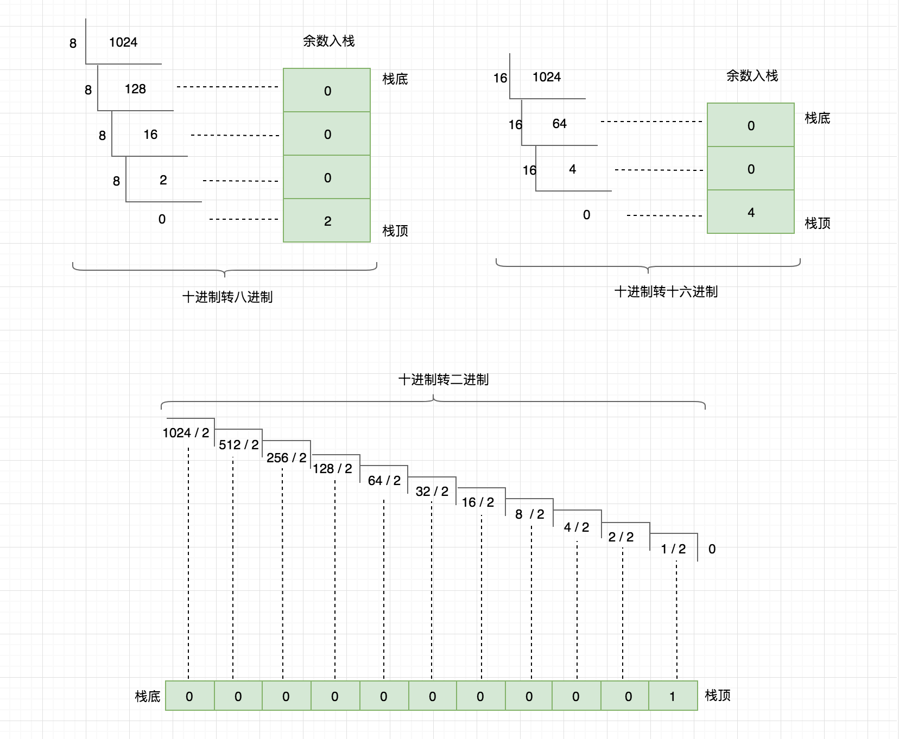

# 数据结构知否知否系列之 — 栈篇

栈，英文 Last In First Out 简称 LIFO，遵从后进先出的原则，与 “队列” 相反，在队列的头部添加元素、删除元素，如果栈中没有元素就称为空栈。

## 栈简介

在现实生活场景中也很多例子，例如盘子叠放，从上面一个一个放置，取时也是从上面一个一个拿走，不可能从下面直接抽着拿，如下图所示


这也是栈的典型应用，通过这个例子也可总结出栈的两个特性：

1. 仅能从栈顶端存取数据
2. 数据存取遵从后进先出原则

## 栈的运行机制

关于栈的概念通过前面的学习，应该有了初步的认知，这里从零实现一个栈进一步对栈的运行机制做一个分析，下面看下我们实现栈需要哪些步骤：

1. Constructor(capacity): 初始化栈内存空间，设定栈的容量
2. isEmpty(): 检查栈是否为空，是否有元素
3. isOverflow(): 检查栈空间是否已满，如果满了是不能在入栈的
4. enStack(element): 栈顶位置入栈，先判断栈是否已满
5. deStack(): 栈顶位置出栈，先判断栈元素是否为空
6. len(): 栈空间已有元素长度
7. clear(): 清空栈元素，内存空间还是保留的
8. destroy(): 销毁栈，同时内存也要回收（通常高级语言都会有自动回收机制，例如 C 语言这时就需要手动回收）
9. traversing(): 遍历输出栈元素

**初始化栈空间**

在构造函数的 constructor 里进行声明，传入 capacity 初始化栈空间同时初始化栈的顶部（top）为 0，底部则无需关注永远为 0。

```js
/**
 * 
 * @param { Number } capacity 栈空间容量
 */
constructor(capacity) {
    if (!capacity) {
        throw new Error('The capacity field is required!');
    }

    this.capacity = capacity;
    this.stack = new Array(capacity);
    this.top = 0; // 初始化栈顶为 0 
}
```

**栈空间是否为空检查**

定义 isEmpty() 方法返回栈空间是否为空，根据 top 栈顶位置进行判断。

```js
isEmpty() {
    return this.top === 0 ? true : false;
}
```

**栈空间是否溢出检查**

定义 isOverflow() 方法返回栈空间是否溢出，根据栈顶位置和栈的空间容量进行判断。

```js
isOverflow() {
    return this.top === this.capacity;
}
```

**入栈**

定义 enStack(element) 方法进行入栈操作，element 为入栈传入的参数，入栈之前先判断，栈是否已满，栈未满情况下可进行入栈操作，最后栈位置做 ++ 操作。

```js
/**
 * 入栈
 * @param { * } element 入栈元素
 */
enStack(element) {
    if (this.isOverflow()) {
        throw new Error('栈已满');
    }

    this.stack[this.top] = element;
    this.top++;
}
```

**出栈**

定义 enStack(element) 方法进行出栈操作，首先判断栈空间是否为空，未空的情况进行出栈操作，注意这里的栈位置，由于元素进栈之后会进行 ++ 操作，那么在出栈时当前栈位置肯定是没有元素的，需要先做 -- 操作。

```js
deStack() {
    if (this.isEmpty()) {
        throw new Error('栈已为空');
    }

    this.top--;
    return this.stack[this.top];
}
```

**栈元素长度**

这个好判断，根据栈的 top 位置信息即可

```js
len() {
    return this.top;
}
```

**清除栈元素**

这里有几种实现，你也可以把 stack 的空间进行初始化，或者把 top 栈位置设为 0 也可。

```js
clear() {
    this.top = 0;
}
```

**栈销毁**

在一些高级语言中都会有垃圾回收机制，例如 JS 中只要当前对象不再持有引用，下次垃圾回收来临时将会被回收。不清楚的可以看看我之前写的 [Node.js 内存管理和 V8 垃圾回收机制](https://mp.weixin.qq.com/s?__biz=MzIyNDU2NTc5Mw==&mid=2247483715&idx=1&sn=00600d07ce4fd2b465d6cc7692d050f0&chksm=e80c4e0ddf7bc71bf22dca61b945eb4ed6dae9b4a3ec8d437ff37212740e276965b7597de413&token=1574280773&lang=zh_CN#rd) 

```js
destroy() {
    this.stack = null;
}
```

**栈元素遍历**

定义 traversing(isBottom) 方法对栈的元素进行遍历输出，默认为顶部遍历，也可传入 isBottom 参数为 true 从底部开始遍历。

```js
traversing(isBottom = false){
    const arr = [];

    if (isBottom) {
        for (let i=0; i < this.top; i++) {
            arr.push(this.stack[i])
        }
    } else {
        for (let i=this.top-1; i >= 0; i--) {
            arr.push(this.stack[i])
        }
    }

    console.log(arr.join(' | '));
}
```

**做一些测试**

做下测试分别看下入栈、出栈、遍历操作，其它的功能大家在练习的过程中可自行实践。

```js
const s1 = new StackStudy(4);

s1.enStack('Nodejs'); // 入栈
s1.enStack('技');
s1.enStack('术');
s1.enStack('栈');
s1.traversing() // 栈 | 术 | 技 | Nodejs
console.log(s1.deStack()); // 出栈 -> 栈
s1.traversing() // 术 | 技 | Nodejs
s1.traversing(true) // 从栈底遍历：Nodejs | 技 | 术
```

下面通过一张图展示以上程序的入栈、出栈过程


栈的运行机制源码地址如下：

```
https://github.com/Q-Angelo/project-training/tree/master/algorithm/stack.js
```

## JavaScript 数组实现栈

JavaScript 中提供的数组功能即可实现一个简单的栈，使用起来也很方便，熟悉相关 API 即可，下面我们来看下基于 JS 数组的入栈、出栈过程实现。


以上图片展示了栈的初始化、入栈、出栈过程，下面我们采用 JavaScript 原型链的方式实现。

**初始化队列**

初始化一个存储栈元素的数据结构，如果未传入默认赋值空数组。

```js
function StackStudy(elements) {
    this.elements = elements || [];
}
```

**添加栈元素**

实现一个 enStack 方法，向栈添加元素，注意只能是栈头添加，使用 JavaScript 数组中的 push 方法。

```js
StackStudy.prototype.enStack = function(element) {
    this.elements.push(element);
}
```

**移除栈元素**

实现一个 deStack 方法，栈尾部弹出元素，使用 JavaScript 数组中的 pop 方法（这一点是和队列不同的）。

```js
StackStudy.prototype.deStack = function() {
    return this.elements.pop();
}
```

通过 JavaScript 数组实现是很简单的，源码如下：

```
https://github.com/Q-Angelo/project-training/tree/master/algorithm/stack-js.js
```

## 栈的经典应用

通过对前面的讲解，相信已经对栈有了一定的了解，那么它可以用来做什么呢，本节举几个典型的应用案例。

### 十进制转换为二进制、八进制、十六进制

现在生活中我们使用最多的是十进制来表示，也是人们最易懂和记得的，但是计算机在处理的时候就要转为二进制进行计算，在十进制与二进制的转换过程之间一般还会用八进制或者十六进制作为二进制的缩写。

因此，这里主要讲解十进制、八进制、十六进制、二进制转换过程中在栈中的实际应用。首先你需要先了解这几种数据类型之间的转换规则，也不难通过一张图来告诉你。



上图中我们用十进制整除需要转换的数据类型(二进制、八进制、十六进制)，将余数放入栈中，明白这个原理在用代码实现就很简单了。

**编码**

```js
const StackStudy = require('./stack.js');
const str = '0123456789ABCDEF';

function dataConversion(num, type) {
    let x = num;
    const s1 = new StackStudy(20);

    while (x != 0) {
        s1.enStack(x % type);
        x = Math.floor(x / type);
    }

    while (!s1.isEmpty()) {
        console.log(str[s1.deStack()]);
    }

    console.log('--------------------');
    return;
}
```

引用我们在**栈的运行机制**里面讲解的代码，编写 dataConversion 方法，入栈、出栈进行遍历输出。代码中定义的变量 str 是为了十六进制会出现字母的情况做的处理。

**测试**

以下运行结果完全符合我们的预期，大家也可用电脑自带的计算器功能进行验证。

```js
// 测试八进制
dataConversion(1024, 8); // 2000

// 测试十六进制
dataConversion(1024, 16); // 400

// 测试十六进制带字母的情况
dataConversion(3000, 16); // BB8

// 测试二进制
dataConversion(1024, 2); // 10000000000
```

十进制转换为二进制、八进制、十六进制源码地址: 

```
https://github.com/Q-Angelo/project-training/tree/master/algorithm/stack-data-conversion.js
```

### 平衡园括号

这个也是另外一个实际问题，在一些运算中你可能写过如下表达式，为了保证操作顺序，使用了括号，但是要注意括号必须是平衡的，每个左括号要对应一个右括号，否则程序将无法正常运行

```js
((1 + 2) * 3 * (4 + 5)) * 6
```

**以上示例组成的平衡表达式**

```
(()())
```

**非平衡表达式**

```
(()()
```

**通过“栈”解决平衡园括号问题实现步骤**

* 初始化一个空栈 {1}
* 遍历需要检测的符号 {2}
* 遍历需要检测的平衡符号都有哪些 {3}
* 如果字符属于入栈的符号（[ { (...）将其入栈 {3.1}
* 如果字符属于闭合的符号，先判断栈空间是否为空，空的情况下中断操作，否则进行出栈，如果出栈的字符也不是闭合符号对应的开放符号，检测失败，中断操作跳出循环 {3.2}
* 每一次循环完成判断当前是否中断，如果已经中断操作，将不合法的字符入栈，中断最外层字符检测循环 {4}
* 最后检测栈是否为空，如果为空则通过，否则不通过输出 {5}

**编码实现**

可以参照 “通过“栈”解决平衡园括号问题实现步骤” 有助于理解以下代码

```js
const Stack = require('./stack');
const detectionStr = '[]()'; // 定义需要检测的平衡符号，如何还有别的符号按照这种格式定义

function test(str) {
    let isTermination = false; // 是否终止，默认 false
    let stack = new Stack(20); // 初始化栈空间 {1}

    for (let i=0; i<str.length; i++) { // {2}
        const s = str[i];
        for (let d=0; d<detectionStr.length; d+=2) { // {3}
            const enStackStr = detectionStr[d]; // 入栈字符
            const deStackStr = detectionStr[d+1]; // 出栈字符

            switch (s) {
                case enStackStr : // 入栈 {3.1}
                    stack.enStack(s);
                    break;
                case deStackStr : // 出栈 {3.2}
                    if (stack.isEmpty()) {
                        isTermination = true
                    } else {
                        const currElement = stack.deStack();
                        if (!currElement.includes(enStackStr)) { 
                            isTermination = true
                        }
                    }
                    break;
            }

            if (isTermination) break;
        }

        if (isTermination) { // 存在不匹配符号，提前终止 {4}
            stack.enStack(s);
            break;
        }
    }

    if (stack.isEmpty()) { // {5}
        console.log('检测通过');
    } else {
        console.log('检测不通过，检测不通过符号：');
        stack.traversing()
    }

    return stack.isEmpty();
}
```

**编码测试**

```js
test('((()()[]])') // 检测不通过，检测不通过符号：](
test('()()[])') // 检测不通过，检测不通过符号：)
test('[()()[]') // 检测不通过，检测不通过符号：[
test('()()][]') // 检测通过
```

平衡园括号问题源码地址: 

```
https://github.com/Q-Angelo/project-training/tree/master/algorithm/stack-balance-symbol.js
```