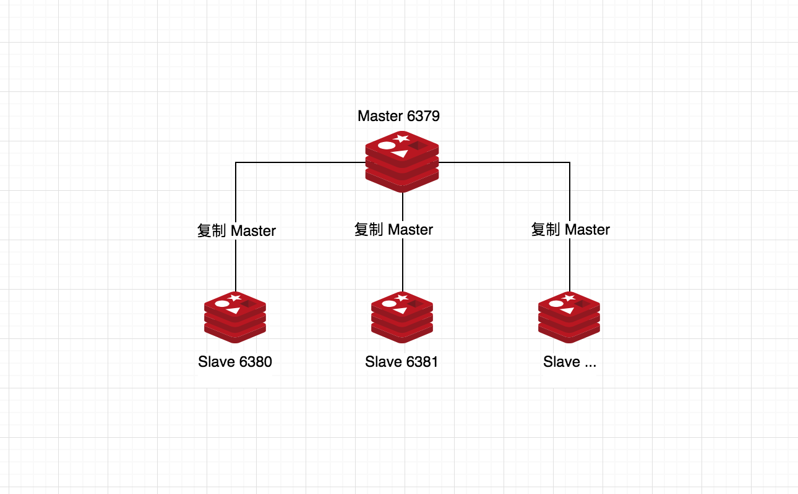
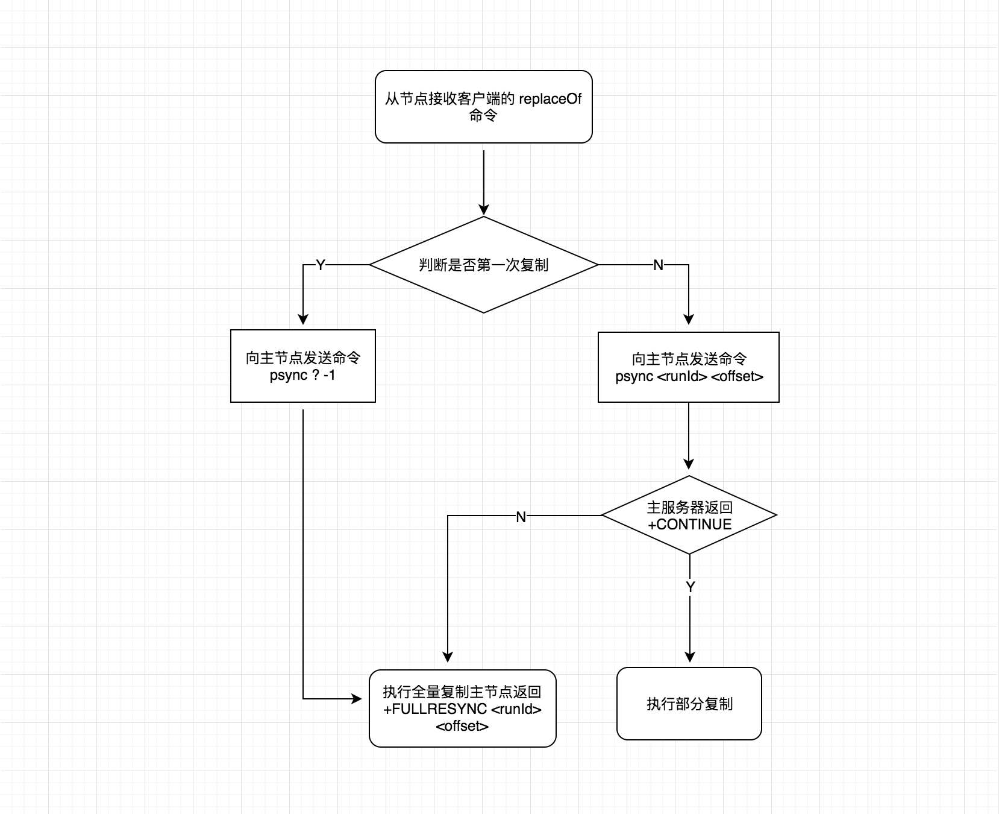

# 主从复制

单机带来的问题机器故障、容量限制、QPS瓶颈，主从复制是一种 **一主多从** 的模式提供了数据副本，解决了单机带来的机器故障问题，另外主从分离模式还提高了 Redis 读的性能。也是高可用、分布式的基础。

## 什么是主从复制？

所谓主从复制就是一个 Redis 主节点拥有多个从节点，由主节点的数据单向的复制到从节点，在一些读多写少的业务场景是非常受用的。



## 实现方式

提供了两种模式命令和配置，采用配置模式，优势是便于管理但是每次更改之后需要重启，采用命令模式优势是无需重启伴随的缺点是不便于管理。两者也是可以结合使用的。

### 命令实现
- slaveof ip port：开启一个主从复制，ip为主节点ip地址，port为主节点端口号，例如在6380机器上开启一个主从复制：```slaveof 127.0.0.1 6379```
- slaveof no one：取消主从复制，取消之前的数据不会清除。如果取消之后在切换到新的主节点，新的主节点同步数据到从节点之前会把该从节点的**先前数据进行全部清楚**
- **注意**在新的版本中 slaveof 命令改为 replicaof

### 配置实现

```shell
slaveof ip port # 设置主节点的 ip
slave-read-only yes # 设置为只读模式
```

## 一主多从实践

在一台虚拟机上建立一个主节点和多个从节点进行实践，注意，这里只是做为一个简单的测试都放在一台机器上，在实际的工作中是不会都放在一台机器上的，假设当前机器出现故障会导致所有节点都不可用。

### 环境准备

机器              |  模式  | 节点 | 安装目录
:----------------|:------|:-------|:---
 192.168.6.128    | Master | 6379 | /data/soft/redis-5.0.5
 192.168.6.128    | Slave1 | 6380 | /data/soft/redis-5.0.5
 192.168.6.128    | Slave2 | 6381 | /data/soft/redis-5.0.5


### Redis安装

这里采用的为 Redis 最新版本 v5.0.5，下载安装于 /data/soft/ 目录下，关于如何安装参考另一篇文章 [Redis 安装]()。

### 节点配置

**执行以下命令，先复制出 3 个节点的配置文件**

```bash
$ cp redis.conf redis-6379.conf
$ cp redis.conf redis-6380.conf
$ cp redis.conf redis-6381.conf
```

**修改 redis-6379.conf 配置**

```conf
 bind 192.168.6.128
 port 6379
 daemonize yes # 开启守护进程
 pidfile /var/run/redis_6379.pid
 logfile "6379.log"
 # save 900 1
 # save 300 10
 # save 60 10000
 dbfilename dump-6379.rdb
 dir /data/soft/redis-5.0.5/data/
 replica-read-only yes # 默认从节点仅是只读模式
```

**修改 redis-6380.conf 配置**

不同于上面主节点的配置是需要设置 replicaof 属性

```conf
 bind 192.168.6.128
 port 6380
 daemonize yes # 开启守护进程
 pidfile /var/run/redis_6380.pid
 logfile "6380.log"
 # save 900 1
 # save 300 10
 # save 60 10000
 dbfilename dump-6380.rdb
 dir /data/soft/redis-5.0.5/data/
 replicaof 192.168.6.128 6379 # 之前版本为 slaveof 192.168.6.128 6379
```

**修改 redis-6381.conf 配置**

在 redis-6381.conf 配置里并没有设置 replicaof 属性，在启动时会介绍如何通过命令启动

```conf
 bind 192.168.6.128
 port 6381
 daemonize yes # 开启守护进程
 pidfile /var/run/redis_6381.pid
 logfile "6381.log"
 # save 900 1
 # save 300 10
 # save 60 10000
 dbfilename dump-6381.rdb
 dir /data/soft/redis-5.0.5/data/
 replicaof <masterip> <masterport> # 暂不修改为从节点
```

### 启动节点

**启动 Master**

```
$ src/redis-server redis-6379.conf
```

**启动 Slave1**

```
$ src/redis-server redis-6380.conf
```

**启动 Slave2**

与上面不同的是，采用命令的方式开启一个从节点

```bash
$ src/redis-server redis-6381.conf
$ src/redis-cli -h 192.168.6.128 -p 6381 replicaof 192.168.6.128 6379
```

### 查看节点

```bash
$ ps -ef | grep redis-server
root      20122      1  0 01:50 ?        00:00:03 src/redis-server 192.168.6.128:6379
root      20130      1  0 01:50 ?        00:00:02 src/redis-server 192.168.6.128:6380
qufei     20172      1  0 02:02 ?        00:00:00 src/redis-server 192.168.6.128:6381
qufei     20414  19405  0 02:27 pts/1    00:00:00 grep --color=auto redis-server
```

### 查看主从节点

链接上主节点客户端之后通过 ```info replication``` 命令查看，如下所示：

* role: 角色（Master/Slave）
* connected_slaves: 当前连接的从节点数量
* slave0、slave1： 展示了从节点的信息

```
$ redis-cli -h 192.168.6.128 -p 6379 info replication
# Replication
role:master
connected_slaves:2
slave0:ip=192.168.6.128,port=6380,state=online,offset=3150,lag=1
slave1:ip=192.168.6.128,port=6381,state=online,offset=0,lag=2
master_replid:6b11e8d93b219d1c612b3cbd26731d8da1c4a881
master_replid2:0000000000000000000000000000000000000000
master_repl_offset:3150
second_repl_offset:-1
repl_backlog_active:1
repl_backlog_size:1048576
repl_backlog_first_byte_offset:1
repl_backlog_histlen:3150
```

## 主从复制原理

通过以上演示，我们已经搭建好了一个主从模式的 Redis 实例，那么主节点、从节点之间的复制过程是怎样的？本节将进行探讨。

#### runId

Redis 在每次启动时会生成一个唯一的字符串来标识当前节点，称为 runId，通过命令 info server 进行查看

```bash
$ redis-cli -h 192.168.6.128 -p 6379 info server | grep run
run_id:d1a715874ad788e8baccfd8eb8227f6bcb4bfe85
```

runId 的作用是从节点向主节点复制过程中（第一次会记录主节点 runId）会比较主节点的 runId，如果不相同，会认为主节点发生了变化，例如第一次启动、主节点重启等，则会进行**全量复制**。

#### 偏移量

主节点、从节点自身都会维护一个偏移量，标识之间的复制情况，随着主节点命令写入而增加相应的字节数，其实这个字节数就对应了偏移量，当主节点从节点的偏移量达到一致情况下，这时是一个完全同步的过程，偏移量也是**部分复制**一个重要的基础，通过命令 info replication  查看

* master_repl_offset：主节点的偏移量
* slave0: 可以看到从节点 6380 中的 offset 此时和主节点是完全一致的
* slave1: 从节点 6381 也一样的

```bash
$ redis-cli -h 192.168.6.128 -p 6379 info replication
# Replication
role:master
connected_slaves:2
slave0:ip=192.168.6.128,port=6380,state=online,offset=30184,lag=0
slave1:ip=192.168.6.128,port=6381,state=online,offset=30184,lag=0
master_replid:6b11e8d93b219d1c612b3cbd26731d8da1c4a881
master_replid2:0000000000000000000000000000000000000000
master_repl_offset:30184
second_repl_offset:-1
repl_backlog_active:1
repl_backlog_size:1048576
repl_backlog_first_byte_offset:1
repl_backlog_histlen:30184
```

在运维方面可以用主从之间的偏移量做为监控，用来判断之间的数据同步是否正常，当两者之间差别很大时在数据同步方面就可能存在了一些问题。

#### 全部复制与部分复制

**全部复制**

全部复制用于从节点和主节点建立链接之后的初次复制，从节点内部会通过 ```psync ${runId} ${offset}``` 命令，runId 当前主节点的 runId，offset 当前节点的偏移量，对于第一次我们是不知道主节点的 runId 和 offset，传递的命令则是 ```psync ? -1``` 将主节点中的所有数据同步给从节点。

**部分复制**

Redis 2.8 之后提供了部分复制功能当从节点因为网络原因断开重链上主节点时，如果条件允许，主节点会将断开的这段时间所丢失的数据同步给从节点，避免每次断开进行全部复制。

**PSYNC命令实现**

不管是全量或部分复制都会通过 ```psync``` 命令进行实现，来看下实现过程

* 服务器接收客户端的 ```replaceof``` 命令判断是否为第一次复制

* 如果之前没有进行过复制则执行 ```psync ? -1``` 进行全量复制

* 如果从服务器已经复制过某个主服务器，那么从服务器再次复制时会发送 ```psync <runid> <offset>``` 命令。
    * runid 是上次复制的主服务器运行 id
    * offset 为从服务器当前的复制偏移量
* 全量服务情况下主服务器返回 ```+FULLRESYNC <runId> <offset>``` 从服务器会将这个 runId 保存起来，主服务器返回的 offset 值，从服务器会做为自己的初始化偏移量也保存起来

* 部分复制情况下主服务器返回 ```+CONTINUE```，从服务器等待主服务器发送自己缺失的那部分数据

