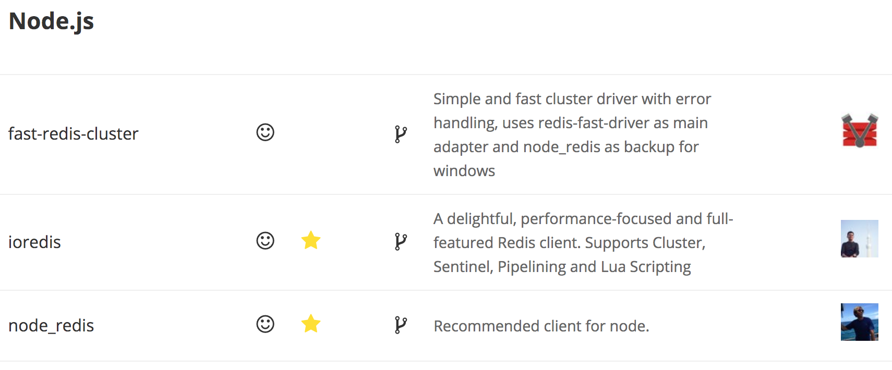

# Redis 基础入门篇

Redis 是一个免费开源、基于内存的高性能 Key-Value 数据库，据阅读排行榜网站 db-engines.com 统计，在 Key-value 存储的数据库中 Redis 依旧是最流行的。

## 为什么要使用 Redis？都有哪些好处？

毋庸置疑 Redis 的应用范围是很广泛的，Redis 具有速度快、数据持久化、丰富的数据类型、多语言支持和多功能等特性，下面分别了解下每种特性。

**速度快**

Redis 号称具有 10W OPS（每秒10万次读写）的能力，Redis 是基于单线程模型，将数据存在于内存中，采用 C 语言(距操作系统最近的语言) 50000 行代码（单机版的 23000 行）编写。

为什么单线程模型如此之快？取决于几个优点：基于内存、非阻塞IO、避免线程切换，这点和 Node.js 很相似，但是单线程需要注意由于一次只能运行一次命令，使用过程中要拒绝慢命令，例如 keys、flushall、flushdb、slow lua script、mutil/exec 等

**持久化**

Redis 之所以快还有一个原因是其基于内存模型，内存中进行数据存储一个典型的问题是断电后或者服务重启会造成数据丢失，那么针对这个问题 Redis 中提出了两种数据持久化策略，分别为 RDB 和 AOF 会将 Redis 在内存中保存的数据异步更新到磁盘中，实现数据的持久化功能，这在之后的一节中会单独进行介绍。

**丰富的数据类型**

Redis 支持丰富的数据类型，除了五个常见的的 String、HashTable、List、Set、Zset 之外 Redis 还新衍生了几个新的类型：`BitMaps`（位图）、`HyperLogLog`（超小内存唯一计数）、`GEO`（地理信息定位）

**多语言**

基于 `TCP` 的通信方式，支持 `Node.js`、`Python`、`Java`、`Ruby`、`Lua` 等，可以参考 Redis 官方介绍 [https://redis.io/clients](https://redis.io/clients) ，每门语言可能会有好多个客户端，该如何选择呢？可以参考以下两点：

* 首先可以选择标记有五角星 ⭐️ 的客户端
* 有笑脸 😊 标记的说明该客户端最近 6 个月是活跃的



**多功能**

Redis 提供了发布订阅、简单的事务功能、pipeline 提高客户端并发效率。另外在 Redis 中的所有单个命令操作都是原子性的，如果想对多个命令一起操作，可以借助 Lua 脚本（实现自定义命令，保证原子性）。

## Redis 与 Memcache 的区别？

可以选择 Redis 做缓存也可以使用 Memcache 有什么区别呢？从以下几个方面来看待：

**数据持久化**

Memcache 仅存于内存中不支持数据持久化，这样如果断电或服务重启都会造成数据丢失，而 Redis 提供了数据持久化的能力，可以分别通过 RDB 或 AOF 两种策略将数据持久化在硬盘中，服务重启或断电也不会造成数据丢失。

**数据类型**

Memcache 对数据类型的支持相对要简单、过于单一，Redis 的数据类型就显得很丰富，支持 String、HashTable、List、Set、Zset 还有最新的 BitMaps、HyperLogLog 等

**Value 大小**

在 Redis 中 Value 可以是字符串、二进制数据，例如，您可以在 Value 内存储 jpeg 图像，但是建议值不要大于 512 MB，这块可以在 Redis 官网看到，以下为原文：

```
Values can be strings (including binary data) of every kind, for instance you can store a jpeg image inside a value. A value can't be bigger than 512 MB.
```

Memcache 的最大 key 长度为 250 个字符，可以接受的 Value 存储数据大小为 1MB，这也是典型的 slab 最大值。

**网络 I/O 模型**

Redis 使用的单线程 I/O 多路复用模型，Memcache 使用的多线程、非阻塞式 I/O 模型。

**数据一致性**

Redis 基于单线程模型，保证了顺序一致性问题，如果有多个命令需要一起操作，也可以使用事物或者编写 Lua 脚本。Memcache 需要借助 CAS（Compare And Set）保证数据一致性，简单的理解就是在进行 set 操作时，加上初始值 Compare，如果初始值发生改变则不允许 set。

CAS 参考 [www.w3cschool.cn/architectroad/architectroad-solve-data-consistency-with-cas.html](https://www.w3cschool.cn/architectroad/architectroad-solve-data-consistency-with-cas.html)

## 通用命令

* keys * ：会遍历出所有的key，生产环境不建议使用时间复杂度O(n)
* dbsize：计算key的总数，Redis内置了这个计数器，会实时更新key的总数，时间复杂度为O(1)
* exists：```exists key``` 检查key是否存在，时间复杂度为O(1)
* expire：```expire key seconds```key在seconds秒后过期，时间复杂度为O(1)
* ttl：```ttl key```key剩余的过期时间（单位：秒），时间复杂度为O(1)
* persist：```persist key```去掉key的过期时间，时间复杂度为O(1)
* type：```type key```查看key的类型，时间复杂度为O(1)

## 五种数据类型

以下仅列举一些常用数据类型，更多信息可参见官网 

#### 字符串

最大限制512MB，适用于缓存、计算器、分布式锁等。

命令 |   含义  | 时间复杂度
:-----:|:------:|:-------:
 set、get、del  | 对key进行设置、读取、删除 | O(1)
 incr、decr     | 计数 | O(1)
 incrby、decrby     | 对计数设置增量 | O(1)
 setnx     | key 存在，不做任何操作 | O(1)
 getset     | 设置新值返回旧值 ``` getset key newValue```|  O(1)
 mset、mget     | 多个key进行设置、读取   | O(n) 

例如，对城市列表数据进行缓存，伪代码如下：

```js
function cityList() {
    const redisKey = 'city';
    let cities = redis.get(redisKey);

    if (!cities) {
        cities = mongo.getCityList();

        redis.set(redisKey, JSON.stringify(cities)); // 存储的时候进行序列化
    }

    return cities;
}
```

#### 哈希

> 所有哈希的命令都是以H开头

- **注意**：在使用hgetall的时候要注意，如果集合很大，将会浪费性能。
- **优点**：节省空间，可以部分更新。
- **缺点**：不支持TTL设置。

命令 |   含义  | 时间复杂度
:-----:|:------:|:-------:
 hset  | 对key进行设置：```hset user:1 name zs age 20``` | O(1)
 hget  | 获取指定属性name：```hget user:1 name``` | O(1)
 hdel  | 删除key指定属性name：```hdel user:1 name``` | O(1)
 hincrby  | ```hincrby user:1 count 1``` | O(1)
 hmset、hmget     | 多个key进行设置、读取   | O(n) 
 hgetall  | 获取key的所有属性：```hgetall user:1``` | O(n)
 hvals  | 获取key的所有value：```hvals user:1``` | O(n)
 hkeys  | 获取key的所有fields：```hkeys user:1``` | O(n)

#### 列表

> 列表的命令都是以L开头

* `Stack（栈）`：后进先出，实现命令`lpush + lpop`
* `Queue（队列）`：先进先出，实现命令`lpush + rpop`
* `Capped Collection（有限集合）`：lpush + ltrim
* `Message Queue（消息队列）`：lpush + brpop


命令 |   含义  | 时间复杂度
:-----:|:------:|:-------:
 rpush  | 列表右端插入一个值: ```rpush arr 1 2 3``` | O(1~n)
 lpush  | 列表左端插入一个值: ```lpush arr 1 2 3``` | O(1~n)
 linsert  | 列表指定的值前后插入新值: ```linsert key before|after value newValue``` ```linsert arr before 2 b``` | O(n)
lpop、rpop  | 列表左侧或者右侧弹出一个值: ```lpop arr | rpop arr``` | O(1)
ltrim  | 按照索引范围修剪列表: ```ltrim key start end``` | O(n)
lrange  | 获取列表指定索引范围所有item: ```lrange key start end（包含end）``` | O(n)
llen  | 获取列表长度: ```llen key``` | O(1)
lset  | 设置列表指定索引值为newValue: ```lset key index newValue``` | O(n)

#### 集合

> 以S开头的命令

* `sadd key element`：集合key中添加元素element，如果element存在则添加失败，O(1)。
* `srem key element`：删除集合中的元素，O(1)。
* `smembers key`：获取集合中所有元素，次命令谨慎使用，O(n)。

#### 有序集合

> 以Z开头的命令

有序集合元素由两部分组成其中score代表分数（排序），具体可以看以命令介绍：

* zadd key score element：集合key中添加元素element，如果element存在则添加失败，O(logN)。
* zrem key element：删除集合中的元素，O(1)。
* zscore key element：返回元素的分数，O(1)。
* zincrby key increScore element：增加或减少元素的分数，O(1)。
* zcard key ：返回元素的个数，O(1)。
* smembers key：获取集合中所有元素，次命令谨慎使用，O(n)。

## Redis高级特性

#### 慢查询

> Redis整个生命周期：发送命令->排队->执行命令->返回结果，慢查询通常发生在执行命令阶段，可以通过满日志查询系统slowlog进行问题定位跟踪。

**在配置文件```redis.conf```中设置：**

* slowlog-max-len：表示满查询最大的条数，默认128，保存在内存中，当超过预先设置的值后会将最早的slowlog删除，是个先进先出队列。
* slowlog-log-slower-than：慢查询阀值，默认10000微秒，只有命令执行时间大于该阀值才会被slowlog记录，如果记录所有命令将阀值设置为0。

**两种设置方式：**
> Redis是一个每秒万级别的，所以在设置阀值的时候，默认为10000微妙（10毫秒），不要设置太大，建议1毫秒之下，这样才有意义。定期将慢查询持久化到其他数据库，便于排查。

* 配置文件```redis.conf```中设置，以下为默认设置：
    * `slowlog-log-slower-than 10000`
    * `slowlog-max-len 128`
* config动态设置slowlog：
    * `slowlog-max-len 1000`
    * `slowlog-log-slower-than 1000`

**慢查询命令：**
* `slowlog get [n]`：获取慢查询队列
* `slowlog len`：获取慢查询队列长度
* `slowlog reset`：清空慢查询队列

#### pipeline

核心：1次网络请求处理n条命令，Redis本身命令处理时间是微妙级别，pipeline主要解决就是减少网络传输的请求。

#### 发布订阅

角色：发布者（publisher）、订阅者（subscriber）、频道（channel）
API：
* 发布消息```publish channel message```
* 订阅消息```subscribe [channe] # 可以订阅多个频道```
* 取消订阅```unsubscribe [channel]```

#### BitMaps（位图）
#### HyperLogLog（超小内存唯一计数
#### GEO
Redis3.2+支持，用于地理信息定位，基于zset实现。

API：
* ```geoadd key longitude latitude member```增加地理位置信息，示例：```geoadd cities: 116.31 39.99 beijing```

* ```geopos key member [member...]```获取地理位置信息，示例：```geopos cities: beijing```

* ```geodist key member1 member2 [unit]```获取两地理位置距离，unit为单位(m，米；km，千米；mi，英里；ft，尺)，示例：```geodist cities: beijing shanghai km```

## 阅读推荐

* [Redis 设计与实现](http://redisbook.com/index.html)
* [Redis 开发与运维](https://book.douban.com/subject/26971561/)
* [Redis CacheCloud](https://github.com/sohutv/cachecloud)
* [极客学院 Redis WIKI](http://wiki.jikexueyuan.com/list/redis/)
