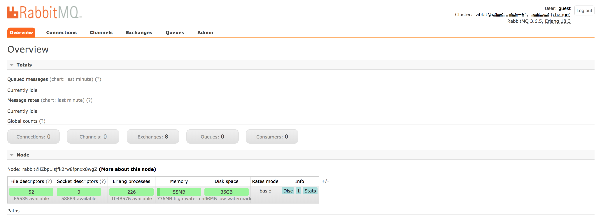
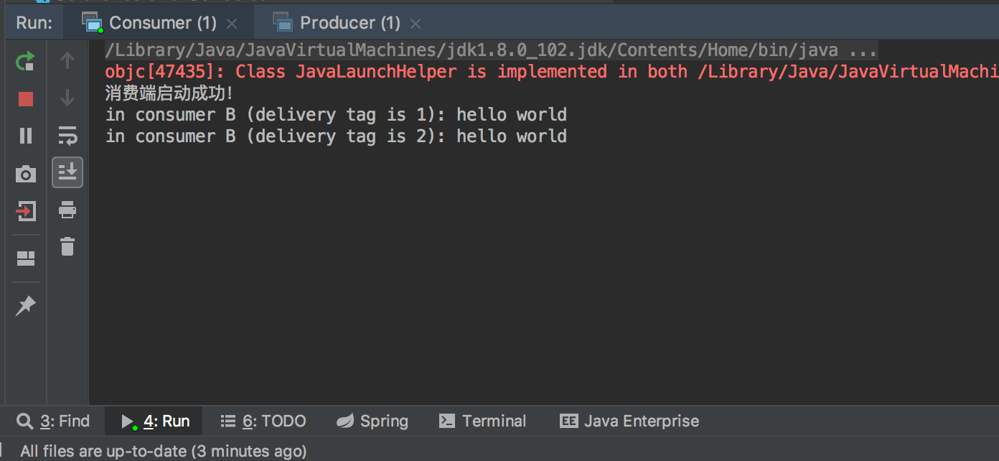

# RabbitMQ 高级消息队列入门篇

RabbitMQ 是一套开源（MPL）的消息队列服务软件，是由 LShift 提供的一个 Advanced Message Queuing Protocol (AMQP) 的开源实现，由以高性能、健壮以及可伸缩性出名的 Erlang 写成。

**通过本篇能学到什么？**

* 为什么要使用 RabbitMQ？
* 常用的主流消息中间件简介都有哪些？
* 如何安装、启动一个 RabbitMQ 服务？
* 如何构建一个简单的生产者与消费者模型？

## 为什么要使用 RabbitMQ？

**1. 同步转异步**

在项目中对于一些没必要同步处理的，可以借助 MQ 进行异步处理，例如，我们的短信发送就可以通过 MQ 队列来做。

**2. 应用解耦**

例如商城业务场景中，订单系统与库存系统，下单的同步可能也要去减少库存，将原本耦合在一块的逻辑可以通过消息队列进行，订单系统发布消息，库存系统订阅消息，这样的好处是一般库存系统出现问题也不会影响到订单系统。

**3. 流量削峰**

流量削峰在一些营销活动、秒杀活动场景中应用还是比较广泛的，如果短时间流量过大，可以通过设置阀值丢弃掉一部分消息或者根据服务的承受能力设置处理消息限制，也就是限流，之后也会单独进行讲解。

## 主流消息中间件简介

* **ActiveMQ**：Apache 出品，早起很流行主要应用于中小企业，面对大量并发场景会有阻塞、消息堆积问题。
* **Kafka**：是由 Apache 软件基金会开发的一个开源流处理平台，由 Scala 和 Java 编写，是一种高吞吐量的分布式发布订阅消息系统，支持单机每秒百万并发。最开始目的主要用于大数据方向日志收集、传输。0.8 版本开始支持复制，不支持事物，因此对消息的重复、丢失、错误没有严格的要求。
* **RocketMQ**：阿里开源的消息中间件，是一款低延迟、高可靠、可伸缩、易于使用的消息中间件，思路起源于 Kafka。最大的问题商业版收费，有些功能不开放。
* **RabbitMQ**：是一个由 erlang（有着和原生 Socket 一样低的延迟）语言开发基于 AMQP 协议的开源消息队列系统。能保证消息的可靠性、稳定性、安全性。

## 安装指南

### Mac版安装

直接通过 ```HomeBrew``` 安装，执行以下命令

```
brew install rabbitmq
```

启动 rabbitmq 

```bash
# 进入安装目录
$ /usr/local/Cellar/rabbitmq/3.7.8

# 启动
$ sbin/rabbitmq-server
```

浏览器输入 ```http://localhost:15672/#/``` 默认用户名密码 guest

### Linux系统安装

#### 安装依赖

```
apt-get install build-essential openssl openssl-devel unixODBC unixODBC-devel make gcc gcc-c++ kernel-devel m4 ncurses-devel tk tc xz lsof
```

#### 获取安装包

rabbitmq和erlang安装包一定要对应，具体可以查看对应关系，官网有说明[RabbitMQ Erlang Version Requirements](http://www.rabbitmq.com/which-erlang.html)

- ***获取erlang安装包***

```
sudo wget http://www.rabbitmq.com/releases/erlang/erlang-18.3-1.el6.x86_64.rpm
```

- ***获取socat安装包***

socat支持多协议，用于协议处理、端口转发，rabbitmq依赖于此。

```
sudo wget http://repo.iotti.biz/CentOS/7/x86_64/socat-1.7.3.2-5.el7.lux.x86_64.rpm
```

- ***获取rabbitmq-server安装包***
rabbitmq-server [```安装包列表```](http://www.rabbitmq.com/releases/rabbitmq-server/)

```
sudo wget http://www.rabbitmq.com/releases/rabbitmq-server/v3.6.5/rabbitmq-server-3.6.5-1.noarch.rpm
```

#### 开始安装

- **Centos rpm 一键安装**

这里采用rpm一键安装，centos 执行命令 ```rpm -ivh erlang-18.3-1.el6.x86_64.rpm```，在 ```ubuntu``` 中不支持此命令 ```rpm```，使用 ```rpm``` 提示如下信息：

```
rpm: RPM should not be used directly install RPM packages, use Alien instead!
rpm: However assuming you know what you are doing...
error: Failed dependencies:
```

- **```ubuntu``` 系统 rpm 一键安装解决方案**
  1. 安装 ```alien```，执行命令 ```sudo apt-get install alien```
  2. 转换 ```rpm``` 包为 ```.deb``` 格式，执行命令 ```sudo alien package.rpm``` 其中 ```package.rpm``` 为你的包名
  3. 通过dpkg安装，```sudo dpkg -i package.deb```

- **以下顺序安装（以下是基于 CentOS 系统安装）**
```
rpm -ivh erlang-18.3-1.el6.x86_64.rpm
rpm -ivh socat-1.7.3.2-5.el7.lux.x86_64.rpm
rpm -ivh rabbitmq-server-3.6.5-1.noarch.rpm
```

- **修改配置文件**
```
vim /usr/lib/rabbitmq/lib/rabbitmq_server-3.6.5/ebin/rabbit.app
```

```js
{loopback_users, [<<"guest">>]}, // 修改为 {loopback_users, [guest]},
```

#### 运行与启动

- **开启 rabbitmq**
```
rabbitmqctl start_app
```

- **开启管理插件**
```
rabbitmq-plugins enable rabbitmq_management
``` 

- **检查状态**
```bash
$ lsof  -i:5672 # 看到以下提示则开启成功
COMMAND  PID     USER   FD   TYPE DEVICE SIZE/OFF NODE NAME
beam    4678 rabbitmq   49u  IPv6 294158      0t0  TCP *:amqp (LISTEN)
```

- **开启管理通知台**
终端更多操作命令，以下有说明，浏览区输入 ```http://host:15672``` 打开管理控制台



- **几个端口区别说明**
    * `5672`：通信默认端口号
    * `15672`：管理控制台默认端口号
    * `25672`：集群通信端口号

`注意:` 阿里云 ECS 服务器如果出现 RabbitMQ 安装成功，外网不能访问是因为安全组的问题没有开放端口 [解决方案](https://blog.csdn.net/lsq_401/article/details/79921221)

- ### 操作命令

|命令                         |   含义  |
|:---------------------------|:------|
| whereis rabbitmq        | 查看rabbitmq安装位置 |
| rabbitmqctl start_app   | 启动应用 |
| whereis erlang | 查看erlang安装位置
| rabbitmqctl start_app | 启动应用
| rabbitmqctl stop_app | 关闭应用
| rabbitmqctl status | 节点状态
| rabbitmqctl add_user username password | 添加用户
| rabbitmqctl list_users | 列出所有用户
| rabbitmqctl delete_user username | 删除用户
| rabbitmqctl add_vhost vhostpath | 创建虚拟主机
| rabbitmqctl list_vhosts| 列出所有虚拟主机
| rabbitmqctl list_queues | 查看所有队列
| rabbitmqctl -p vhostpath purge_queue blue | 清除队列里消息

## 构建一个简单的生产者与消费者模型

生产者发消息的时候必须要指定一个 exchange，若不指定 exchange（为空）会默认指向 `AMQP default` 交换机，`AMQP default` 路由规则是根据 routingKey 和 mq 上有没有相同名字的队列进行匹配路由。

### 构建生产者与消费者步骤

**生产者步骤**
- 创建链接工厂
- 通过链接工厂创建链接
- 通过链接创建通道（channel）
- 通过 channel 发送数据
- 关闭链接

**消费者步骤**
- 创建链接工厂
- 通过链接工厂创建链接
- 通过链接创建通道（channel）
- 声明一个队列
- 创建消费者
- 设置 channel

### Node.js 版本

**amqplib 客户端**

Github: [https://github.com/squaremo/amqp.node](https://github.com/squaremo/amqp.node)

```
$ npm install amqplib
```

**构建生产者**

```js
const amqp = require('amqplib');

async function producer() {
    // 1. 创建链接对象
    const connection = await amqp.connect('amqp://localhost:5672');

    // 2. 获取通道
    const channel = await connection.createChannel();

    // 3. 声明参数
    const routingKey = 'helloworldQueue';
    const msg = 'hello world';

    for (let i=0; i<5; i++) {
        // 4. 发送消息
        await channel.publish('', routingKey, Buffer.from(`${msg} 第${i}条消息`));
    }

    // 5. 关闭链接
    await channel.close();
}

producer();
```

**构建消费者**

```js
const amqp = require('amqplib');

async function consumer() {
    // 1. 创建链接对象
    const connection = await amqp.connect('amqp://localhost:5672');

    // 2. 获取通道
    const channel = await connection.createChannel();

    // 3. 声明参数
    const queueName = 'helloworldQueue';

    // 4. 声明队列，交换机默认为 AMQP default
    await channel.assertQueue(queueName);

    // 5. 消费
    await channel.consume(queueName, msg => {
        console.log('Consumer：', msg.content.toString());
        channel.ack(msg);
    });
}

consumer();
```

**Node.js 示例代码**

```
源码地址如下：
https://github.com/Q-Angelo/project-training/tree/master/rabbitmq/helloworld
```

### Java 版本

**添加 maven 依赖**

在 ```Spring Boot``` 项目的 ```pom.xml``` 文件中引入 ```amqp-client``` 启动器

```xml
<dependency>
    <groupId>com.rabbitmq</groupId>
    <artifactId>amqp-client</artifactId>
    <version>5.6.0</version>
</dependency>
```

**构建生产者**

```java
package com.may.rabbitmq.helloworld;

import com.rabbitmq.client.Channel;
import com.rabbitmq.client.Connection;
import com.rabbitmq.client.ConnectionFactory;

public class Producer {
    public static void main(String[] args) throws Exception {
        // 1. 创建链接工厂
        ConnectionFactory connectionFactory = new ConnectionFactory();
        connectionFactory.setHost("127.0.0.1");
        connectionFactory.setPort(5672);
        connectionFactory.setVirtualHost("/");

        // 2. 通过链接工厂创建链接
        Connection connection = connectionFactory.newConnection();

        // 3. 通过链接创建通道（channel）
        Channel channel = connection.createChannel();

        // 4. 通过 channel 发送数据
        // exchange：交换机，如果不传默认为 AMQP default
        channel.basicPublish("", "helloworldQueue", null, "hello world".getBytes());

        // 5. 关闭链接
        channel.close();
        connection.close();
    }
}
```

**构建消费者**

```java
package com.may.rabbitmq.helloworld;

import com.rabbitmq.client.*;

import java.io.IOException;
import java.util.concurrent.TimeUnit;

public class Consumer {
    public static void main(String[] args) throws Exception {
        // 1. 创建链接工厂
        ConnectionFactory connectionFactory = new ConnectionFactory();
        connectionFactory.setHost("127.0.0.1");
        connectionFactory.setPort(5672);
        connectionFactory.setVirtualHost("/");

        // 2. 通过链接工厂创建链接
        Connection connection = connectionFactory.newConnection();

        // 3. 通过链接创建通道（channel）
        Channel channel = connection.createChannel();

        // 4. 声明一个队列
        String queueName = "helloworldQueue";
        channel.queueDeclare(queueName, true, false, false, null);

        // 5. 创建消费者
        // springboot 从 1.5.9 升级到 2.0.0，QueueingConsumer 报错（Cannot resolve symbol 'QueueingConsumer'）没有这个类，改为使用 DefaultConsumer
        DefaultConsumer consumer = new DefaultConsumer(channel) {
            @Override
            public void handleDelivery(String consumerTag, Envelope envelope, AMQP.BasicProperties properties, byte[] body) throws IOException {
                super.handleDelivery(consumerTag, envelope, properties, body);

                String message = new String(body, "UTF-8");
                System.out.printf("in consumer B (delivery tag is %d): %s\n", envelope.getDeliveryTag(), message);
                // System.out.printf("d%: s%\n", envelope.getDeliveryTag(), message);

                try {
                    TimeUnit.MILLISECONDS.sleep(200);
                } catch (InterruptedException e) {

                }

                channel.basicAck(envelope.getDeliveryTag(), false);
            }
        };


        // 6. 设置 channel
        channel.basicConsume(queueName, false, consumer);

        System.out.println("消费端启动成功！");
    }
}
```

**运行测试**



**Java 示例代码**

```
小项目大思想 — SpringBoot 实战系列
https://github.com/Q-Angelo/SpringBoot-Course

源码地址如下：
https://github.com/Q-Angelo/SpringBoot-Course/tree/master/chapter8/chapter8-1
```