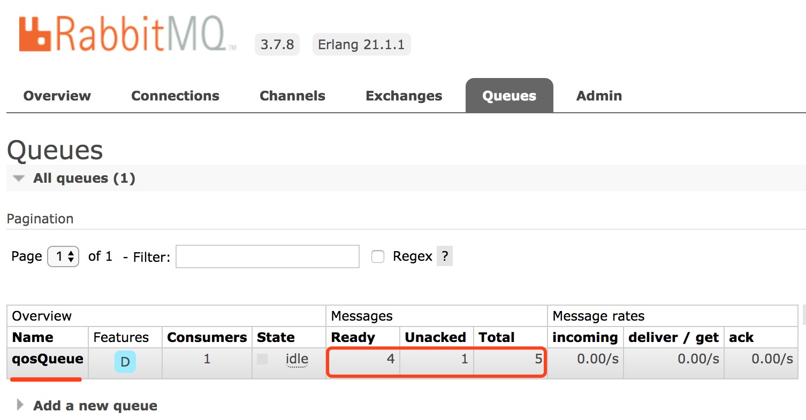
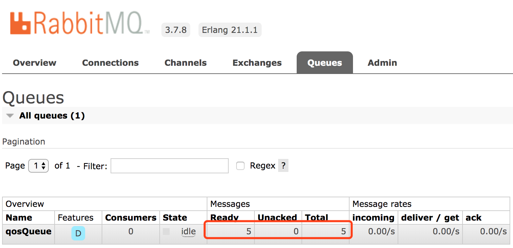
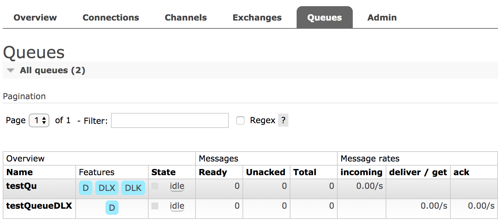

# RabbitMQ高级消息队列

## 快速导航
* [主流消息中间件简介](/docs/microservice/rabbitmq-base.md#主流消息中间件简介)
* [RabbitMQ安装](/docs/microservice/rabbitmq-base.md#安装)
    - `[RabbitMQ安装]` Mac版安装
    - `[RabbitMQ安装]` Linux系统（Ubuntu、CentOS）安装 
    - `[RabbitMQ安装]` 运行与启动 
* [RabbitMQ高级特性消费端限流策略实现](/docs/microservice/rabbitmq-base.md#RabbitMQ高级特性消费端限流策略实现)
    - `[QOS]` 业务场景
    - `[QOS]` RabbitMQ消费端限流机制
    - `[QOS]` 建立生产端
    - `[QOS]` 建立消费端
    - `[QOS]` RabbitMQ限流使用总结
* [RabbitMQ延迟队列实现定时任务](/docs/microservice/rabbitmq-base.md#RabbitMQ延迟队列实现定时任务)
    - `[DLX]` 死信队列
    - `[TTL]` 消息TTL的存活时间
    - `[Task]` Nodejs操作RabbitMQ实现延迟队列

## 主流消息中间件简介

* ```ActiveMQ```：Apache出品，早起很流行主要应用于中小企业，面对大量并发场景会有阻塞、消息堆积问题。
* ```Kafka```：是由Apache软件基金会开发的一个开源流处理平台，由Scala和Java编写，是一种高吞吐量的分布式发布订阅消息系统，支持单机每秒百万并发。最开始目的主要用于大数据方向日志收集、传输。0.8版本开始支持复制，不支持事物，因此对消息的重复、丢失、错误没有严格的要求。
* ```RocketMQ```：阿里开源的消息中间件，是一款低延迟、高可靠、可伸缩、易于使用的消息中间件，思路起源于Kafka。最大的问题商业版收费，有些功能不开放。
* ```RabbitMQ```：是一个由erlang（有着和原生Socket一样低的延迟）语言开发基于AMQP协议的开源消息队列系统。能保证消息的可靠性、稳定性、安全性。

## 安装

* ### Mac版安装

直接通过```HomeBrew```安装，执行以下命令

```brew install rabbitmq```

启动rabbitmq

进入安装目录 ```/usr/local/Cellar/rabbitmq/3.7.8``` 
启动 ```sbin/rabbitmq-server```

浏览器输入```http://localhost:15672/#/```，默认用户名密码：guest

* ### Linux系统安装

#### 安装依赖
```apt-get install build-essential openssl openssl-devel unixODBC unixODBC-devel make gcc gcc-c++ kernel-devel m4 ncurses-devel tk tc xz lsof```

#### 获取安装包

rabbitmq和erlang安装包一定要对应，具体可以查看对应关系，官网有说明[RabbitMQ Erlang Version Requirements](http://www.rabbitmq.com/which-erlang.html)

- ***获取erlang安装包***

```sudo wget http://www.rabbitmq.com/releases/erlang/erlang-18.3-1.el6.x86_64.rpm```

- ***获取socat安装包***

socat支持多协议，用于协议处理、端口转发，rabbitmq依赖于此。

``` sudo wget http://repo.iotti.biz/CentOS/7/x86_64/socat-1.7.3.2-5.el7.lux.x86_64.rpm ```

- ***获取rabbitmq-server安装包***
rabbitmq-server [```安装包列表```](http://www.rabbitmq.com/releases/rabbitmq-server/)
```sudo wget http://www.rabbitmq.com/releases/rabbitmq-server/v3.6.5/rabbitmq-server-3.6.5-1.noarch.rpm```


#### 安装

- **Centos rpm一键安装**

这里采用rpm一键安装，centos 执行命令 ```rpm -ivh erlang-18.3-1.el6.x86_64.rpm```，在```ubuntu```中不支持此命令```rpm```，使用```rpm```提示如下信息：

```bash
rpm: RPM should not be used directly install RPM packages, use Alien instead!
rpm: However assuming you know what you are doing...
error: Failed dependencies:
```

- **```ubuntu```系统rpm一键安装解决方案**
  1. 安装```alien```，执行命令```sudo apt-get install alien```
  2. 转换```rpm```包为```.deb```格式，执行命令```sudo alien package.rpm```其中```package.rpm```为你的包名
  3. 通过dpkg安装，```sudo dpkg -i package.deb```

- **以下顺序安装（以下是基于CentOS系统安装）**
```shell
rpm -ivh erlang-18.3-1.el6.x86_64.rpm
rpm -ivh socat-1.7.3.2-5.el7.lux.x86_64.rpm
rpm -ivh rabbitmq-server-3.6.5-1.noarch.rpm
```

- **修改配置文件**
```
vim /usr/lib/rabbitmq/lib/rabbitmq_server-3.6.5/ebin/rabbit.app
```

```js
{loopback_users, [<<"guest">>]}, // 修改为 {loopback_users, [guest]},
```

#### 运行与启动

- **开启rabbitmq**
```
rabbitmqctl start_app
```

- **开启管理插件**
```
rabbitmq-plugins enable rabbitmq_management
``` 

- **检查状态**
```shell
$ lsof  -i:5672 # 看到以下提示则开启成功
COMMAND  PID     USER   FD   TYPE DEVICE SIZE/OFF NODE NAME
beam    4678 rabbitmq   49u  IPv6 294158      0t0  TCP *:amqp (LISTEN)
```

- **开启管理通知台**
终端更多操作命令，以下有说明，浏览区输入```http://host:15672```打开管理控制台


- **几个端口区别说明**
    * `5672`：通信默认端口号
    * `15672`：管理控制台默认端口号
    * `25672`：集群通信端口号

`注意:` 阿里云ECS服务器如果出现RabbitMQ安装成功，外网不能访问是因为安全组的问题没有开放端口[解决方案](https://blog.csdn.net/lsq_401/article/details/79921221)

## 操作命令

* ```whereis rabbitmq```：查看rabbitmq安装位置
* ```whereis erlang```：查看erlang安装位置
* ```rabbitmqctl start_app```：启动应用
* ```rabbitmqctl stop_app```：关闭应用
* ```rabbitmqctl status```：节点状态
* ```rabbitmqctl add_user username password```：添加用户
* ```rabbitmqctl list_users```：列出所有用户
* ```rabbitmqctl delete_user username```：删除用户
* ```rabbitmqctl add_vhost vhostpath```：创建虚拟主机
* ```rabbitmqctl list_vhosts```：列出所有虚拟主机
* ```rabbitmqctl list_queues```：查看所有队列
* ```rabbitmqctl -p vhostpath purge_queue blue```：清除队列里消息

## 

- **Exchange**
用于接收消息，根据路由键转发消息绑定队列
* Name：交换机名称
* Type：交换机类型direct、topic、fanout、headers
    * direct：不需要Exchange进行绑定，根据RoutingKey匹配消息路由到指定的队列。
    * topic：生产者指定RoutingKey消息根据消费端指定的队列通过模糊匹配的方式进行相应转发，两种通配符模式：
        * `#`：可匹配一个或多个关键字
        * `*`：只能匹配一个关键字

* Durability：是否需要持久化
* Auto Delete：最后一个绑定到Exchange上的队列删除之后自动删除该Exchange
* Internal：当前Exchange是否应用于RabbitMQ内部使用，默认false。
* Arguments：扩展参数
    

## 生产者与消费者

1. 生产者发消息的时候必须要指定一个exchange，若不指定exchange（为空）会默认指向 `AMQP default` 交换机，`AMQP default`路由规则是根据routingKey和mq上有没有相同名字的队列进行匹配路由。

## RabbitMQ高级特性消费端限流策略实现

> 应用范围为服务访问量突然剧增，原因可能有多种外部的调用或内部的一些问题导致消息积压，对服务的访问超过服务所能处理的最大峰值，导致系统超时负载从而崩溃。

### 业务场景

举一些我们平常生活中的消费场景，例如：火车票、机票、门票等，通常来说这些服务在下单之后，后续的出票结果都是异步通知的，如果服务本身只支持每秒1000访问量，由于外部服务的原因突然访问量增加到每秒2000并发，这个时候服务接收者因为流量的剧增，超过了自己系统本身所能处理的最大峰值，如果没有对消息做限流措施，系统在这段时间内就会造成不可用，在生产环境这是一个很`严重`的问题，实际应用场景不止于这些，本文通过RabbitMQ来讲解如果对消费端做限流措施。

### 消费端限流机制

RabbitMQ提供了服务质量保证 (`QOS`) 功能，对channel（通道）预先设置一定的消息数目，每次发送的消息条数都是基于预先设置的数目，如果消费端一旦有未确认的消息，这时服务端将不会再发送新的消费消息，直到消费端将消息进行完全确认，注意：此时消费端不能设置自动签收，否则会无效。

在 `RabbitMQ v3.3.0` 之后，放宽了限制，除了对channel设置之外，还可以对每个消费者进行设置。

以下为 Node.js 开发语言 `amqplib` 库对于限流实现提供的接口方法 `prefetch`

```js
export interface Channel extends events.EventEmitter {
    prefetch(count: number, global?: boolean): Promise<Replies.Empty>;
    ...
}
```

**prefetch 参数说明**：

* number：每次推送给消费端 N 条消息数目，如果这 N 条消息没有被ack，生产端将不会再次推送直到这 N 条消息被消费。
* global：在哪个级别上做限制，ture 为 channel 上做限制，false 为消费端上做限制，默认为 false。


### 建立生产端

生产端没什么变化，和正常声明一样，关于源码参见[rabbitmq-prefetch（Node.js客户端版Demo）](https://github.com/Q-Angelo/project-training/tree/master/nodejs/rabbitmq-prefetch)

```js
const amqp = require('amqplib');

async function producer() {
    // 1. 创建链接对象
    const connection = await amqp.connect('amqp://localhost:5672');

    // 2. 获取通道
    const channel = await connection.createChannel();

    // 3. 声明参数
    const exchangeName = 'qosEx';
    const routingKey = 'qos.test001';
    const msg = 'Producer：';

    // 4. 声明交换机
    await channel.assertExchange(exchangeName, 'topic', { durable: true });
    
    for (let i=0; i<5; i++) {
        // 5. 发送消息
        await channel.publish(exchangeName, routingKey, Buffer.from(`${msg} 第${i}条消息`));
    }

    await channel.close();
}

producer();
```

### 建立消费端

```js
const amqp = require('amqplib');

async function consumer() {
    // 1. 创建链接对象
    const connection = await amqp.connect('amqp://localhost:5672');

    // 2. 获取通道
    const channel = await connection.createChannel();

    // 3. 声明参数
    const exchangeName = 'qosEx';
    const queueName = 'qosQueue';
    const routingKey = 'qos.#';

    // 4. 声明交换机、对列进行绑定
    await channel.assertExchange(exchangeName, 'topic', { durable: true });
    await channel.assertQueue(queueName);
    await channel.bindQueue(queueName, exchangeName, routingKey);
    
    // 5. 限流参数设置
    await channel.prefetch(1, false);

    // 6. 限流，noAck参数必须设置为false
    await channel.consume(queueName, msg => {
        console.log('Consumer：', msg.content.toString());

        // channel.ack(msg);
    }, { noAck: false });
}

consumer();
```

- **未确认消息情况测试**

在 consumer 中我们暂且将 `channel.ack(msg)` 注释掉，分别启动生产者和消费者，看看是什么情况？



如上图所示，总共5条消息按照预先设置的发送了一条消息，因为我将 `channel.ack(msg)` 注释掉了，服务端在未得到 ack 确认，将不会在发送剩下已 Ready 消息。

- **确认消息测试**

修改 consumer 代码，打开确认消息注释，重新启动消费端进行测试

```js
await channel.consume(queueName, msg => {
    console.log('Consumer：', msg.content.toString());

    channel.ack(msg); // 打开注释
}, { noAck: false });
```



如上图所示，Unacked 未0，消息已全部消费成功。

### RabbitMQ限流使用总结

限流在我们的实际工作中还是很有意义的，在使用上生产端没有变化，重点在消费端着重看以下两点

* 限流情况ack不能设置自动签收，修改 `{ noAck: false }`
* 增加限流参数设置 `channel.prefetch(1, false)`


## RabbitMQ幂等性实现

### 业界常见幂等解决方案

* 利用数据库主键设置唯一id
* Redis的原子性功能实现

## RabbitMQ延迟队列实现定时任务

> 实际业务中对于定时任务的需求是不可避免的，例如，订单超时自动取消、每天定时拉取数据等，在Node.js中系统层面提供了setTimeout、setInterval两个API或通过node-schedule这种第三方库来实现。

> 通过这种方式实现对于简单的定时任务是ok的，过于复杂的、可用性要求较高的系统就会存在以下缺点。

- **存在的一些问题**
    1. 消耗系统内存，如果定时任务很多，长时间得不到释放，将会一直占用系统进程耗费内存。
    2. 单线程如何保障出现系统崩溃后之前的定时任务不受影响？多进程集群模式下一致性的保证？
    3. setTimeout、setInterval会存在时间误差，对于时间精度要求较高的是不行的。

- **RabbitMQ TTL+DLX 实现定时任务**

RabbitMQ本身是不支持的，可以通过它提供的两个特性[Time-To-Live and Expiration](https://www.rabbitmq.com/ttl.html#per-queue-message-ttl)、[Dead Letter Exchanges](https://www.rabbitmq.com/dlx.html)来实现，通过以下泳道图可以看到一个消息从发布到消费的整个过程。


### 死信队列

死信队列全称 Dead-Letter-Exchange 简称 DLX 是 RabbitMQ 中交换器的一种类型，消息在一段时间之后没有被消费就会变成死信被重新 publish 到另一个 DLX 交换器队列中，因此称为死信队列。

- **死信队列产生几种情况**
    * 消息被拒绝
    * 消息TTL过期
    * 队列达到最大长度

- **设置DLX的两个参数：**
    * `deadLetterExchange`: 设置DLX，当正常队列的消息成为死信后会被路由到DLX中
    * `deadLetterRoutingKey`: 设置DLX指定的路由键

**`注意`**：Dead-Letter-Exchange也是一种普通的Exchange

### 消息TTL

消息的TTL指的是消息的存活时间，RabbitMQ支持消息、队列两种方式设置TTL，分别如下：

- **消息设置TTL**：对消息的设置是在发送时进行TTL设置，通过`x-message-ttl` 或` expiration` 字段设置，单位为毫秒，代表消息的过期时间，每条消息的TTL可不同。

- **队列设置TTL**：对队列的设置是在消息入队列时计算，通过 `x-expires` 设置，队列中的所有消息都有相同的过期时间，当超过了队列的超时设置，消息会自动的清除。

**`注意`**：如果以上两种方式都做了设置，消息的TTL则以两者之中最小的那个为准。

### Nodejs操作RabbitMQ实现延迟队列

推荐采用 [amqplib](https://github.com/squaremo/amqp.node)库，一个Node.js实现的RabbitMQ客户端。

- **初始化RabbitMQ**

`rabbitmq.js`

```js
// npm install amqplib
const amqp = require('amqplib');

let connection = null;

module.exports = {
    connection,

    init: () => amqp.connect('amqp://localhost:5672').then(conn => {
        connection = conn;

        console.log('rabbitmq connect success');

        return connection;
    })
}
```

- **生产者**

```js
/**
 * 路由一个死信队列
 * @param { Object } connnection 
 */
async function producerDLX(connnection) {
    const testExchange = 'testEx';
    const testQueue = 'testQu';
    const testExchangeDLX = 'testExDLX';
    const testRoutingKeyDLX = 'testRoutingKeyDLX';
    
    const ch = await connnection.createChannel();
    await ch.assertExchange(testExchange, 'direct', { durable: true });
    const queueResult = await ch.assertQueue(testQueue, {
        exclusive: false,
        deadLetterExchange: testExchangeDLX,
        deadLetterRoutingKey: testRoutingKeyDLX,
    });
    await ch.bindQueue(queueResult.queue, testExchange);
    const msg = 'hello world!';
    console.log('producer msg：', msg);
    await ch.sendToQueue(queueResult.queue, new Buffer(msg), {
        expiration: '10000'
    });
    
    ch.close();
}
```

- **消费者**

`consumer.js`

```js
const rabbitmq = require('./rabbitmq.js');

/**
 * 消费一个死信队列
 * @param { Object } connnection 
 */
async function consumerDLX(connnection) {
    const testExchangeDLX = 'testExDLX';
    const testRoutingKeyDLX = 'testRoutingKeyDLX';
    const testQueueDLX = 'testQueueDLX';

    const ch = await connnection.createChannel();
    await ch.assertExchange(testExchangeDLX, 'direct', { durable: true });
    const queueResult = await ch.assertQueue(testQueueDLX, {
        exclusive: false,
    });
    await ch.bindQueue(queueResult.queue, testExchangeDLX, testRoutingKeyDLX);
    await ch.consume(queueResult.queue, msg => {
        console.log('consumer msg：', msg.content.toString());
    }, { noAck: true });
}

// 消费消息
rabbitmq.init().then(connection => consumerDLX(connection));

```

- **运行查看**

分别执行消费者和生产者，可以看到 producer 在44秒发布了消息，consumer 是在54秒接收到的消息，实现了定时10秒种执行

```shell
$ node consumer # 执行消费者
[2019-05-07T08:45:23.099] [INFO] default - rabbitmq connect success
[2019-05-07T08:45:54.562] [INFO] default - consumer msg： hello world!
```

```shell
$ node producer # 执行生产者
[2019-05-07T08:45:43.973] [INFO] default - rabbitmq connect success
[2019-05-07T08:45:44.000] [INFO] default - producer msg： hello world!
```

- **管理控制台查看**

testQu 队列为我们定义的正常队列消息过期，会变成死信，会被路由到 testQueueDLX 队列，形成一个死信队列。



- **注意问题**

> 一个队列里的某个消息即使比同队列中的其它消息提前过期，也不会优先进入到死信队列，只有当过期的消息到了队列的顶端，才会被真正的丢弃或者进入死信队列。

- **源码地址**：[RabbitMQ延迟队列实现定时任务（Node.js客户端版Demo）](https://github.com/Q-Angelo/project-training/tree/master/nodejs/rabbitmq-timed-task)