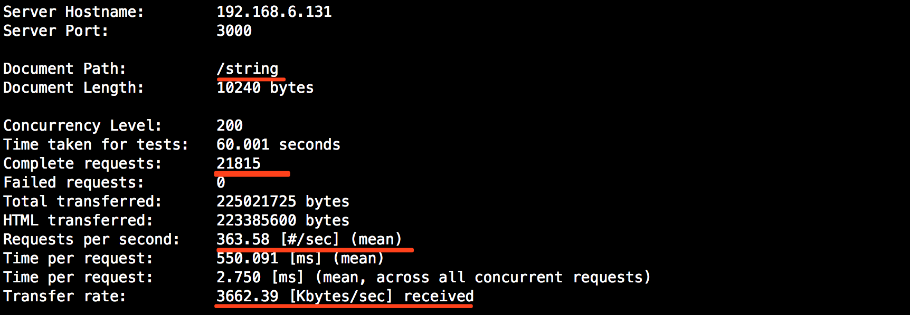
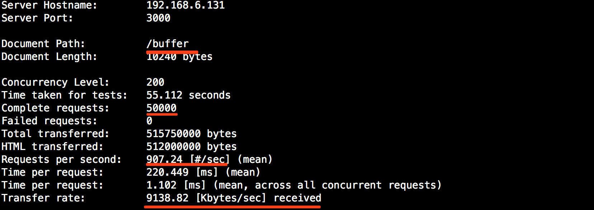

# Node.js 中的 Buffer 是什么？

从前端转入 Node.js 的童鞋对这一部分内容会比较陌生，因为在前端中一些简单的字符串操作已经满足基本的业务需求，有时可能也会觉得 Buffer、Stream 这些会很神秘。回到服务端，如果你不想只做一名普通的 Node.js 开发工程师，你应该深入去学习一下 Buffer 揭开这一层神秘的面纱，同时也会让你对 Node.js 的理解提升一个水平。

## 快速导航

- [Buffer 初识](#Buffer初识)
    - 什么是二进制数据？
    - 什么是 Stream？
    - 什么是 Buffer？
- [Buffer 基本使用](#Buffer基本使用)
    - 创建 Buffer
    - Buffer 字符编码
    - 字符串与 Buffer 类型互转
- [Buffer 内存机制](#Buffer内存机制)
    - Buffer 内存分配原理
    - 8KB 限制
    - 透过 buffer.js 源码了解 Buffer 对象分配
    - Buffer 内存分配总结
- [Buffer 应用场景](#Buffer应用场景)
    - I/O 操作
    - zlib.js
    - 加解密
- [Buffer VS Cache](#buffer-vs-cache)
- [Buffer VS String](#buffer-vs-string)

## 面试指南

* ``` 缓冲（Buffer）与缓存（Cache）的区别？ ```，参考：[#](#buffer-vs-cache)

## Buffer初识

在引入 TypedArray 之前，JavaScript 语言没有用于读取或操作二进制数据流的机制。 Buffer 类是作为 Node.js API 的一部分引入的，用于在 TCP 流、文件系统操作、以及其他上下文中与八位字节流进行交互。这是来自 Node.js 官网的一段描述，比较晦涩难懂，总结起来一句话 **Node.js 可以用来处理二进制流数据或者与之进行交互**。

Buffer 用于读取或操作二进制数据流，做为 Node.js API 的一部分使用时无需 require，用于操作网络协议、数据库、图片和文件 I/O 等一些需要大量二进制数据的场景。Buffer 在创建时大小已经被确定且是无法调整的，在内存分配这块 Buffer 是由 C++ 层面提供而不是 V8 具体后面会讲解。

在这里不知道你是否认为这是很简单的？但是上面提到的一些关键词```二进制```、```流（Stream）```、```缓冲区（Buffer）```，这些又都是什么呢？下面尝试做一些简单的介绍。

### 什么是二进制数据？

二进制数据使用 0 和 1 两个数码来表示的数据，为了存储或展示一些数据，计算机需要先将这些数据转换为二进制来表示。例如，我想存储 66 这个数字，计算机会先将数字 66 转化为二进制 01000010 表示，印象中第一次接触这个是在大学期间 C 语言课程中，转换公式如下所示：

| 128 | 64  | 32  | 16  | 8   | 4   | 2   | 1   |
|:---:|:---:|:---:|:---:|:---:|:---:|:---:|:---:|
| 0   | 1   | 0   | 0   | 0   | 0   | 1   | 0   |

上面用数字举了一个示例，我们知道数字只是数据类型之一，其它的还有字符串、图像、文件等。例如我们对一个英文 M 操作，在 JavaScript 里通过 ```'M'.charCodeAt()``` 取到对应的 ASCII 码之后（通过以上的步骤）会转为二进制表示。

### 什么是 Stream？

流，英文 Stream 是对输入输出设备的抽象，这里的设备可以是文件、网络、内存等。

流是有方向性的，当程序从某个数据源读入数据，会开启一个输入流，这里的数据源可以是文件或者网络等，例如我们从 a.txt 文件读入数据。相反的当我们的程序需要写出数据到指定数据源（文件、网络等）时，则开启一个输出流。当有一些大文件操作时，我们就需要 Stream 像管道一样，一点一点的将数据流出。

**举个例子**

我们现在有一大罐水需要浇一片菜地，如果我们将水罐的水一下全部倒入菜地，首先得需要有多么大的力气（这里的力气好比计算机中的硬件性能）才可搬得动。如果，我们拿来了水管将水一点一点流入我们的菜地，这个时候不要这么大力气就可完成。

通过上面的讲解进一步的理解了 Stream 是什么？那么 Stream 和 Buffer 之间又是什么关系呢？看以下介绍，关于 Stream 本身也有很多知识点，欢迎关注公众号「Nodejs技术栈」，之后会单独进行介绍。

### 什么是 Buffer？

通过以上 Stream 的讲解，我们已经看到数据是从一端流向另一端，那么他们是如何流动的呢？

通常，数据的移动是为了处理或者读取它，并根据它进行决策。伴随着时间的推移，每一个过程都会有一个最小或最大数据量。如果数据到达的速度比进程消耗的速度快，那么少数早到达的数据会处于等待区等候被处理。反之，如果数据到达的速度比进程消耗的数据慢，那么早先到达的数据需要等待一定量的数据到达之后才能被处理。

这里的等待区就指的缓冲区（Buffer），它是计算机中的一个小物理单位，通常位于计算机的 RAM 中。这些概念可能会很难理解，不要担心下面通过一个例子进一步说明。

**公共汽车站乘车例子**

举一个公共汽车站乘车的例子，通常公共汽车会每隔几十分钟一趟，在这个时间到达之前就算乘客已经满了，车辆也不会提前发车，早到的乘客就需要先在车站进行等待。假设到达的乘客过多，后到的一部分则需要在公共汽车站等待下一趟车驶来。

在上面例子中的等待区公共汽车站，对应到我们的 Node.js 中也就是缓冲区（Buffer），另外乘客到达的速度是我们不能控制的，我们能控制的也只有何时发车，对应到我们的程序中就是我们无法控制数据流到达的时间，可以做的是能决定何时发送数据。

## Buffer基本使用

了解了 Buffer 的一些概念之后，我们来看下 Buffer 的一些基本使用，这里并不会列举所有的 API 使用，仅列举一部分常用的，对于完成推荐大家去 [Node.js 中文网观看](http://nodejs.cn/api/buffer.html)。

### 创建Buffer

在 6.0.0 之前的 Node.js 版本中， Buffer 实例是使用 Buffer 构造函数创建的，该函数根据提供的参数以不同方式分配返回的 Buffer ```new Buffer()```。

现在可以通过 Buffer.from()、Buffer.alloc() 与 Buffer.allocUnsafe() 三种方式来创建

**Buffer.from()**

```js
const b1 = Buffer.from('10');
const b2 = Buffer.from('10', 'utf8');
const b3 = Buffer.from([10]);
const b4 = Buffer.from(b3);

console.log(b1, b2, b3, b4); // <Buffer 31 30> <Buffer 31 30> <Buffer 0a> <Buffer 0a>
```

**Buffer.alloc**

返回一个已初始化的 Buffer，可以保证新创建的 Buffer 永远不会包含旧数据。

```js
const bAlloc1 = Buffer.alloc(10); // 创建一个大小为 10 个字节的缓冲区

console.log(bAlloc1); // <Buffer 00 00 00 00 00 00 00 00 00 00>
```

**Buffer.allocUnsafe**

创建一个大小为 size 字节的新的未初始化的 Buffer，由于 Buffer 是未初始化的，因此分配的内存片段可能包含敏感的旧数据。在 Buffer 内容可读情况下，则可能会泄露它的旧数据，这个是不安全的，使用时要谨慎。

```js
const bAllocUnsafe1 = Buffer.allocUnsafe(10);

console.log(bAllocUnsafe1); // <Buffer 49 ae c9 cd 49 1d 00 00 11 4f>
```

### Buffer 字符编码

通过使用字符编码，可实现 Buffer 实例与 JavaScript 字符串之间的相互转换，目前所支持的字符编码如下所示：

* 'ascii' - 仅适用于 7 位 ASCII 数据。此编码速度很快，如果设置则会剥离高位。
* 'utf8' - 多字节编码的 Unicode 字符。许多网页和其他文档格式都使用 UTF-8。
* 'utf16le' - 2 或 4 个字节，小端序编码的 Unicode 字符。支持代理对（U+10000 至 U+10FFFF）。
* 'ucs2' - 'utf16le' 的别名。
* 'base64' - Base64 编码。当从字符串创建 Buffer 时，此编码也会正确地接受 RFC 4648 第 5 节中指定的 “URL 和文件名安全字母”。
* 'latin1' - 一种将 Buffer 编码成单字节编码字符串的方法（由 RFC 1345 中的 IANA 定义，第 63 页，作为 Latin-1 的补充块和 C0/C1 控制码）。
* 'binary' - 'latin1' 的别名。
* 'hex' - 将每个字节编码成两个十六进制的字符。

```js
const buf = Buffer.from('hello world', 'ascii');
console.log(buf.toString('hex')); // 68656c6c6f20776f726c64
```

### 字符串与 Buffer 类型互转

**字符串转 Buffer**

这个相信不会陌生了，通过上面讲解的 Buffer.form() 实现，如果不传递 encoding 默认按照 UTF-8 格式转换存储

```js
const buf = Buffer.from('Node.js 技术栈', 'UTF-8');

console.log(buf); // <Buffer 4e 6f 64 65 2e 6a 73 20 e6 8a 80 e6 9c af e6 a0 88>
console.log(buf.length); // 17
```

**Buffer 转换为字符串**

Buffer 转换为字符串也很简单，使用 toString([encoding], [start], [end]) 方法，默认编码仍为 UTF-8，如果不传 start、end 可实现全部转换，传了 start、end 可实现部分转换（这里要小心了）

```js
const buf = Buffer.from('Node.js 技术栈', 'UTF-8');

console.log(buf); // <Buffer 4e 6f 64 65 2e 6a 73 20 e6 8a 80 e6 9c af e6 a0 88>
console.log(buf.length); // 17
console.log(buf.toString('UTF-8', 0, 9)); // Node.js �
```

运行查看，可以看到以上输出结果为 ```Node.js �``` 出现了乱码，为什么？

**转换过程中为什么出现乱码？**

首先以上示例中使用的默认编码方式 UTF-8，问题就出在这里一个中文在 UTF-8 下占用 3 个字节，```技``` 这个字在 buf 中对应的字节为 ```8a 80 e6```
而我们的设定的范围为 0～9 因此只输出了 ```8a```，这个时候就会造成字符被截断出现乱码。

下面我们改下示例的截取范围：

```js
const buf = Buffer.from('Node.js 技术栈', 'UTF-8');

console.log(buf); // <Buffer 4e 6f 64 65 2e 6a 73 20 e6 8a 80 e6 9c af e6 a0 88>
console.log(buf.length); // 17
console.log(buf.toString('UTF-8', 0, 11)); // Node.js 技
```

可以看到已经正常输出了


## Buffer内存机制

在 [Nodejs 中的 内存管理和 V8 垃圾回收机制](https://www.nodejs.red/#/nodejs/memory) 一节主要讲解了在 Node.js 的垃圾回收中主要使用 V8 来管理，但是并没有提到 Buffer 类型的数据是如何回收的，下面让我们来了解 Buffer 的内存回收机制。

由于 Buffer 需要处理的是大量的二进制数据，假如用一点就向系统去申请，则会造成频繁的向系统申请内存调用，所以 Buffer 所占用的内存**不再由 V8 分配**，而是在 Node.js 的 **C++ 层面完成申请**，在 **JavaScript 中进行内存分配**。因此，这部分内存我们称之为**堆外内存**。

**注意**：以下使用到的 buffer.js 源码为 Node.js v10.x 版本，地址：[https://github.com/nodejs/node/blob/v10.x/lib/buffer.js](https://github.com/nodejs/node/blob/v10.x/lib/buffer.js)

### Buffer内存分配原理

Node.js 采用了 slab 机制进行**预先申请、事后分配**，是一种动态的管理机制。

使用 Buffer.alloc(size) 传入一个指定的 size 就会申请一块固定大小的内存区域，slab 具有如下三种状态：

* full：完全分配状态
* partial：部分分配状态
* empty：没有被分配状态

**8KB 限制**

Node.js 以 8KB 为界限来区分是小对象还是大对象，在 [buffer.js](https://github.com/nodejs/node/blob/v10.x/lib/buffer.js) 中可以看到以下代码

```js
Buffer.poolSize = 8 * 1024; // 102 行，Node.js 版本为 v10.x
```

在 **Buffer 初识** 一节里有提到过 ```Buffer 在创建时大小已经被确定且是无法调整的``` 到这里应该就明白了。

**Buffer 对象分配**

以下代码示例，在加载时直接调用了 createPool() 相当于直接初始化了一个 8 KB 的内存空间，这样在第一次进行内存分配时也会变得更高效。另外在初始化的同时还初始化了一个新的变量 **poolOffset = 0** 这个变量会记录已经使用了多少字节。

```js
Buffer.poolSize = 8 * 1024;
var poolSize, poolOffset, allocPool;

... // 中间代码省略

function createPool() {
  poolSize = Buffer.poolSize;
  allocPool = createUnsafeArrayBuffer(poolSize);
  poolOffset = 0;
}
createPool(); // 129 行
```

此时，新构造的 slab 如下所示：


现在让我们来尝试分配一个大小为 2048 的 Buffer 对象，代码如下所示：

```js
Buffer.alloc(2 * 1024)
```

现在让我们先看下当前的 slab 内存是怎么样的？如下所示：


那么这个分配过程是怎样的呢？让我们再看 buffer.js 另外一个核心的方法 allocate(size)

```js
// https://github.com/nodejs/node/blob/v10.x/lib/buffer.js#L318
function allocate(size) {
  if (size <= 0) {
    return new FastBuffer();
  }

  // 当分配的空间小于 Buffer.poolSize 向右移位，这里得出来的结果为 4KB
  if (size < (Buffer.poolSize >>> 1)) {
    if (size > (poolSize - poolOffset))
      createPool();
    var b = new FastBuffer(allocPool, poolOffset, size);
    poolOffset += size; // 已使用空间累加
    alignPool(); // 8 字节内存对齐处理
    return b;
  } else { // C++ 层面申请
    return createUnsafeBuffer(size);
  }
}
```

读完上面的代码，已经很清晰的可以看到何时会分配小 Buffer 对象，又何时会去分配大 Buffer 对象。

### Buffer 内存分配总结

这块内容着实难理解，翻了几本 Node.js 相关书籍，朴灵大佬的「深入浅出 Node.js」Buffer 一节还是讲解的挺详细的，推荐大家去阅读下。

1. 在初次加载时就会初始化 1 个 **8KB 的内存空间**，buffer.js 源码有体现
2. 根据申请的内存大小分为 **小 Buffer 对象** 和 **大 Buffer 对象**
3. 小 Buffer 情况，会继续判断这个 slab 空间是否足够
    3.1 如果空间足够就去使用剩余空间同时更新 slab 分配状态，偏移量会增加
    3.2 如果空间不足，slab 空间不足，就会去创建一个新的 slab 空间用来分配
4. 大 Buffer 情况，则会直接走 createUnsafeBuffer(size) 函数
5. 不论是小 Buffer 对象还是大 Buffer 对象，内存分配是在 C++ 层面完成，内存管理在 JavaScript 层面，最终还是可以被 V8 的垃圾回收标记所回收。

## Buffer应用场景

以下列举一些 Buffer 在实际业务中的应用场景，也欢迎大家在评论区补充！

### I/O 操作

关于 I/O 可以是文件或网络 I/O，以下为通过流的方式将 input.txt 的信息读取出来之后写入到 output.txt 文件，关于 Stream 与 Buffer 的关系不明白的在回头看下 **Buffer 初识** 一节讲解的 ```什么是 Stream?```、```什么是 Buffer?```

```js
const fs = require('fs');

const inputStream = fs.createReadStream('input.txt'); // 创建可读流
const outputStream = fs.createWriteStream('output.txt'); // 创建可写流

inputStream.pipe(outputStream); // 管道读写
```

在 Stream 中我们是不需要手动去创建自己的缓冲区，在 Node.js 的**流中将会自动创建**。

### zlib.js

zlib.js 为 Node.js 的核心库之一，其利用了缓冲区（Buffer）的功能来操作二进制数据流，提供了压缩或解压功能。参考源代码 [zlib.js 源码](https://github.com/nodejs/node/blob/master/lib/zlib.js)

### 加解密

在一些加解密算法中会遇到使用 Buffer，例如 crypto.createCipheriv 的第二个参数 key 为 String 或 Buffer 类型，如果是 Buffer 类型，就用到了本篇我们讲解的内容，以下做了一个简单的加密示例，重点使用了 Buffer.alloc() 初始化一个实例（这个上面有介绍），之后使用了 fill 方法做了填充，这里重点在看下这个方法的使用。

**buf.fill(value[, offset[, end]][, encoding])**

* value: 第一个参数为要填充的内容
* offset: 偏移量，填充的起始位置
* end: 结束填充 buf 的偏移量
* encoding: 编码集

**以下为 Cipher 的对称加密 Demo**

```js
const crypto = require('crypto');
const [key, iv, algorithm, encoding, cipherEncoding] = [
    'a123456789', '', 'aes-128-ecb', 'utf8', 'base64'
];

const handleKey = key => {
    const bytes = Buffer.alloc(16); // 初始化一个 Buffer 实例，每一项都用 00 填充
    console.log(bytes); // <Buffer 00 00 00 00 00 00 00 00 00 00 00 00 00 00 00 00>
    bytes.fill(key, 0, 10) // 填充
    console.log(bytes); // <Buffer 61 31 32 33 34 35 36 37 38 39 00 00 00 00 00 00>

    return bytes;
}

let cipher = crypto.createCipheriv(algorithm, handleKey(key), iv);
let crypted = cipher.update('Node.js 技术栈', encoding, cipherEncoding);
    crypted += cipher.final(cipherEncoding);

console.log(crypted) // jE0ODwuKN6iaKFKqd3RF4xFZkOpasy8WfIDl8tRC5t0=
```

## Buffer VS Cache

> 缓冲（Buffer）与缓存（Cache）的区别？

**缓冲（Buffer）**

缓冲（Buffer）是用于处理二进制流数据，将数据缓冲起来，它是临时性的，对于流式数据，会采用缓冲区将数据临时存储起来，等缓冲到一定的大小之后在存入硬盘中。视频播放器就是一个经典的例子，有时你会看到一个缓冲的图标，这意味着此时这一组缓冲区并未填满，当数据到达填满缓冲区并且被处理之后，此时缓冲图标消失，你可以看到一些图像数据。

**缓存（Cache）**

缓存（Cache）我们可以看作是一个中间层，它可以是永久性的将热点数据进行缓存，使得访问速度更快，例如我们通过 Memory、Redis 等将数据从硬盘或其它第三方接口中请求过来进行缓存，目的就是将数据存于内存的缓存区中，这样对同一个资源进行访问，速度会更快，也是性能优化一个重要的点。

来自知乎的一个讨论，点击 [more](https://www.zhihu.com/question/26190832) 查看

## Buffer VS String

通过压力测试来看看 String 和 Buffer 两者的性能如何？

```js
const http = require('http');
let s = '';
for (let i=0; i<1024*10; i++) {
    s+='a'
}

const str = s;
const bufStr = Buffer.from(s);
const server = http.createServer((req, res) => {
    console.log(req.url);

    if (req.url === '/buffer') {
        res.end(bufStr);
    } else if (req.url === '/string') {
        res.end(str);
    }
});

server.listen(3000);
```

以上实例我放在虚拟机里进行测试，你也可以在本地电脑测试，使用 AB 测试工具。

**测试 string**

看以下几个重要的参数指标，之后通过 buffer 传输进行对比

* Complete requests:      21815
* Requests per second:    363.58 [#/sec] (mean)
* Transfer rate:          3662.39 [Kbytes/sec] received

```
$ ab -c 200 -t 60 http://192.168.6.131:3000/string
```



**测试 buffer**

可以看到通过 buffer 传输总共的请求数为 50000、QPS 达到了两倍多的提高、每秒传输的字节为 9138.82 KB，从这些数据上可以证明提前将数据转换为 Buffer 的方式，可以使性能得到近一倍的提升。

* Complete requests:      50000
* Requests per second:    907.24 [#/sec] (mean)
* Transfer rate:          9138.82 [Kbytes/sec] received

```
$ ab -c 200 -t 60 http://192.168.6.131:3000/buffer
```



在 HTTP 传输中传输的是二进制数据，上面例子中的 /string 接口直接返回的字符串，这时候 HTTP 在传输之前会先将字符串转换为 Buffer 类型，以二进制数据传输，通过流（Stream）的方式一点点返回到客户端。但是直接返回 Buffer 类型，则少了每次的转换操作，对于性能也是有提升的。

在一些 Web 应用中，对于静态数据可以预先转为 Buffer 进行传输，可以有效减少 CPU 的重复使用（重复的字符串转 Buffer 操作）。

## Reference

- [http://nodejs.cn/api/buffer.html](http://nodejs.cn/api/buffer.html)
- [深入浅出 Node.js Buffer](https://book.douban.com/subject/25768396/)
- [Do you want a better understanding of Buffer in Node.js? Check this out.](https://www.freecodecamp.org/news/do-you-want-a-better-understanding-of-buffer-in-node-js-check-this-out-2e29de2968e8/)
- [A cartoon intro to ArrayBuffers and SharedArrayBuffers](https://hacks.mozilla.org/2017/06/a-cartoon-intro-to-arraybuffers-and-sharedarraybuffers/)
- [buffer.js v10.x](https://github.com/nodejs/node/blob/v10.x/lib/buffer.js)